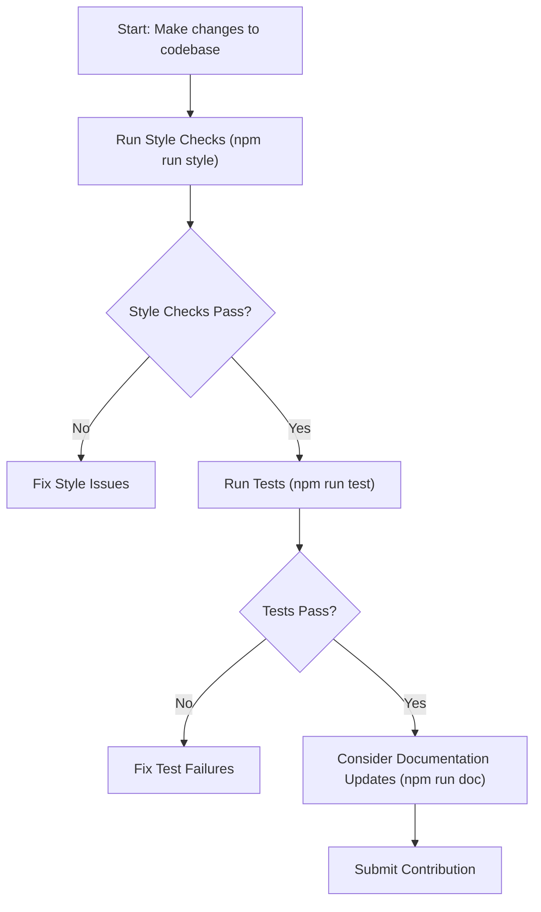

# Contributing

This guide provides essential information for developers interested in contributing to the Lodash project. It covers key aspects of the codebase, including how to ensure your contributions meet style conventions, pass tests, and integrate with the build process. For a high-level overview of the project structure and related resources, you can refer to the [Overview](./overview.md) section. You can also view the official [Contributing Guide on GitHub](https://github.com/lodash/lodash/blob/master/.github/CONTRIBUTING.md).

## Contribution Workflow

To ensure the quality and consistency of contributions, Lodash provides a streamlined workflow, encapsulated by the `npm run validate` script. This script executes both style checks and tests, ensuring your changes adhere to project standards before submission.



## Code Style Guidelines

Maintaining a consistent code style is crucial for readability and maintainability. Before submitting your code, ensure it adheres to Lodash's style conventions. You can automatically check your changes using the `npm run style` command, which utilizes `jscs` for code linting.

```shell
$ npm run style
```

This command executes several sub-commands to check different parts of the codebase:

*   `npm run style:main`: Checks the main `lodash.js` file.
*   `npm run style:fp`: Checks files in the `fp/` directory and common utility files in `lib/**/*.js`.
*   `npm run style:perf`: Checks performance-related scripts located in the `perf/` directory.
*   `npm run style:test`: Checks the style of test files in the `test/` directory.

## Testing Your Changes

Verifying your changes through testing is a critical step in the contribution process. The `npm run test` command executes the primary test suites for both the main and functional programming (FP) builds of Lodash.

```shell
$ npm run test
```

This command combines the following test executions:

*   `npm run test:main`: Runs tests specifically for the main Lodash build.
*   `npm run test:fp`: Runs tests for the functional programming build.

Additionally, to ensure the correctness of code examples embedded within the documentation, use the `npm run test:doc` command:

```shell
$ npm run test:doc
```

This command utilizes `markdown-doctest` to validate code snippets found in markdown documentation files, such as `doc/*.md`.

## Building the Distribution

When contributing changes that affect the core library, it's beneficial to understand how the distribution files are generated. The `npm run build` command compiles the Lodash source code into its various distribution formats.

```shell
$ npm run build
```

This command executes the build processes for both the main and functional programming modules, ensuring all necessary distribution files (e.g., `lodash.js`, `lodash.min.js`, `lodash.core.js`) are created or updated in the `dist/` directory.

## Updating Documentation

For new features, bug fixes affecting behavior, or changes to existing methods, you will likely need to update the documentation. Lodash uses `docdown` to generate documentation directly from comments within the source code.

```shell
$ npm run doc
```

This command generates the primary `README.md` documentation file, formatted for GitHub. For the official Lodash website documentation, a different command is used:

```shell
$ npm run doc:site
```

This generates the markdown for the site's documentation. The `npm run doc:sitehtml` command, used internally, then converts this markdown to HTML and integrates it into the website's structure.

By following these guidelines and utilizing the provided scripts, you can effectively contribute to the Lodash project, ensuring high-quality and consistent additions. Your efforts help maintain Lodash as a valuable utility library. To learn more about the overall project, you can refer to the [Overview](./overview.md) section.