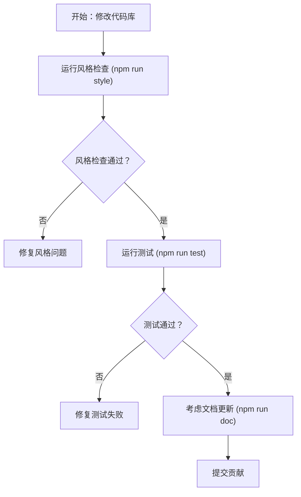

# 贡献

本指南为有兴趣为 Lodash 项目贡献的开发者提供了重要信息。它涵盖了代码库的关键方面，包括如何确保您的贡献符合风格约定、通过测试并与构建过程集成。有关项目结构和相关资源的高级概述，您可以参考 [概述](./overview.md) 部分。您还可以查看 GitHub 上的官方 [贡献指南](https://github.com/lodash/lodash/blob/master/.github/CONTRIBUTING.md)。

## 贡献工作流

为确保贡献的质量和一致性，Lodash 提供了一个简化的工作流，由 `npm run validate` 脚本封装。该脚本执行风格检查和测试，确保您的更改在提交前符合项目标准。



## 代码风格指南

保持一致的代码风格对于可读性和可维护性至关重要。在提交代码之前，请确保它符合 Lodash 的风格约定。您可以使用 `npm run style` 命令自动检查您的更改，该命令利用 `jscs` 进行代码检查。

```shell
$ npm run style
```

此命令执行多个子命令以检查代码库的不同部分：

*   `npm run style:main`: 检查主 `lodash.js` 文件。
*   `npm run style:fp`: 检查 `fp/` 目录中的文件以及 `lib/**/*.js` 中的常见实用程序文件。
*   `npm run style:perf`: 检查位于 `perf/` 目录中的性能相关脚本。
*   `npm run style:test`: 检查 `test/` 目录中测试文件的风格。

## 测试您的更改

通过测试验证您的更改是贡献过程中的关键一步。 `npm run test` 命令执行 Lodash 的主构建和函数式编程 (FP) 构建的主要测试套件。

```shell
$ npm run test
```

此命令结合了以下测试执行：

*   `npm run test:main`: 专门为 Lodash 主构建运行测试。
*   `npm run test:fp`: 为函数式编程构建运行测试。

此外，为确保文档中嵌入的代码示例的正确性，请使用 `npm run test:doc` 命令：

```shell
$ npm run test:doc
```

此命令利用 `markdown-doctest` 验证在 markdown 文档文件（例如 `doc/*.md`）中找到的代码片段。

## 构建分发

当贡献影响核心库的更改时，了解分发文件如何生成是有益的。 `npm run build` 命令将 Lodash 源代码编译成各种分发格式。

```shell
$ npm run build
```

此命令为主模块和函数式编程模块执行构建过程，确保所有必要的分发文件（例如，`lodash.js`、`lodash.min.js`、`lodash.core.js`）在 `dist/` 目录中创建或更新。

## 更新文档

对于新功能、影响行为的错误修复或现有方法的更改，您可能需要更新文档。Lodash 使用 `docdown` 直接从源代码中的注释生成文档。

```shell
$ npm run doc
```

此命令生成主要的 `README.md` 文档文件，格式适用于 GitHub。对于官方 Lodash 网站文档，使用不同的命令：

```shell
$ npm run doc:site
```

这为站点文档生成 markdown。 `npm run doc:sitehtml` 命令（内部使用）然后将此 markdown 转换为 HTML 并将其集成到网站结构中。

通过遵循这些指南并利用所提供的脚本，您可以有效地为 Lodash 项目做出贡献，确保高质量和一致的添加。您的努力有助于将 Lodash 维护为一个有价值的实用程序库。要了解更多关于整个项目的信息，您可以参考 [概述](./overview.md) 部分。