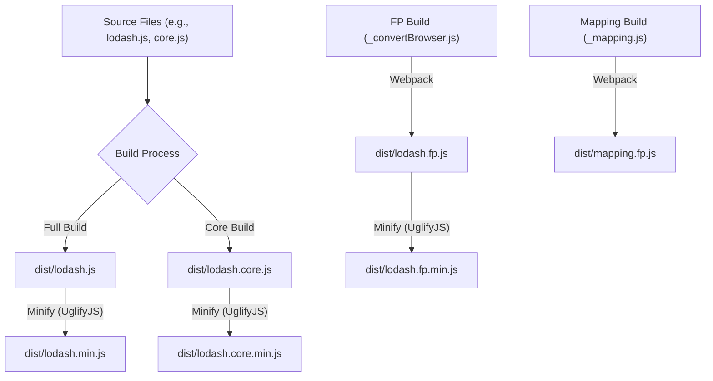

# Module Formats & Custom Builds

Understanding Lodash's various module formats and the ability to create custom builds is key to optimizing your application's performance and bundle size. Lodash provides flexible options to integrate its utility functions, whether you're working in a browser, Node.js, or with modern module bundlers.

For an overview of Lodash's core principles, refer to the [Core Concepts](./core-concepts.md) section.

## Lodash Module Formats

Lodash is available in several module formats to cater to different development environments and preferences. Each format is designed to offer the best possible experience and integration.

| Format | Description | Usage Context | npm Package/Path |
|---|---|---|---|
| **UMD (Universal Module Definition)** | The standard full build, compatible with browser `<script>` tags, AMD, and CommonJS environments. Includes all Lodash methods. | Browsers, older Node.js versions, environments without advanced bundlers. | `lodash` (full build), `lodash/core` (core build) |
| **ES Modules** | Modern JavaScript modules, designed for tree-shaking by bundlers like Webpack, Rollup, or Parcel. Allows you to import only the methods you need. | Modern web applications, environments using ES Module imports. | `lodash-es` |
| **Functional Programming (FP)** | Provides immutable, auto-curried, iteratee-first, data-last methods, promoting a more declarative programming style. | Functional programming paradigms, projects prioritizing immutability. | `lodash/fp` |
| **Per Method Packages** | Individual npm packages for each Lodash method, allowing granular dependency management. | Projects needing only a few specific methods, micro-libraries. | e.g., `lodash.get`, `lodash.map` (browse [lodash-modularized](https://www.npmjs.com/browse/keyword/lodash-modularized) on npm) |
| **AMD** | Asynchronous Module Definition, suitable for asynchronous loading in browsers. | Asynchronous module loaders (e.g., RequireJS). | `lodash-amd` |

## Custom Builds and Optimization

To minimize your application's footprint, especially in browser environments, Lodash supports custom builds. This allows you to include only the necessary functions, thereby reducing the final bundle size.

### Generating Custom Builds

Lodash provides a command-line interface (`lodash-cli`) for generating custom builds. This tool allows you to create specific versions of the library tailored to your needs.

For example, to generate a core build of Lodash, which is a smaller version containing a subset of commonly used functions, you can use the `lodash-cli`:

```shell
# Install lodash-cli globally
$ npm i -g npm
$ npm i --save lodash
$ npm i -g lodash-cli

# Generate a full build
$ lodash -o ./dist/lodash.js

# Generate a core build
$ lodash core -o ./dist/lodash.core.js
```

The build process involves copying the base `lodash.js` and then minifying it to `lodash.min.js`. The core build, `lodash.core.js`, is also provided with a minified version `lodash.core.min.js`.



Minification is handled by `uglify-js`, which compresses the JavaScript code to reduce its size, applying optimizations like collapsing variables and removing warnings.

### Optimizing ES Module Imports

When using ES Modules (`lodash-es`), you can leverage bundler plugins to automatically optimize your imports and enable tree-shaking, ensuring that only the Lodash methods you actually use are included in your final bundle:

*   **`babel-plugin-lodash`**: A Babel plugin that transforms Lodash imports to cherry-pick methods, enabling effective tree-shaking.
*   **`lodash-webpack-plugin`**: A Webpack plugin that provides even more aggressive tree-shaking for Lodash by removing unused modules.

These tools work by analyzing your code and rewriting Lodash import statements to directly import individual methods (e.g., `import { map } from 'lodash';` becomes `import map from 'lodash/map';`). This allows bundlers to easily identify and exclude unused code, resulting in smaller, more efficient bundles.

## Conclusion

By understanding the different Lodash module formats and utilizing custom build strategies, you can significantly optimize your application's performance and bundle size. Choose the format and build that best fits your project's requirements and development workflow.

To explore the full range of Lodash methods, proceed to the [API Reference](./api-reference.md) section.