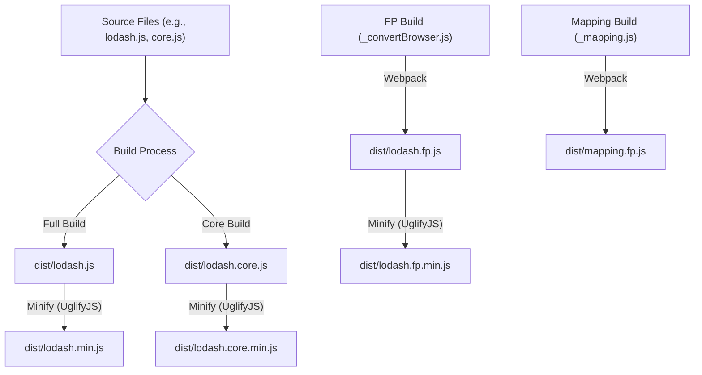

# 模块格式与自定义构建

了解 Lodash 的各种模块格式以及创建自定义构建的能力，是优化应用程序性能和包大小的关键。无论您是在浏览器、Node.js 还是使用现代模块打包工具，Lodash 都提供灵活的选项来集成其实用函数。

有关 Lodash 核心原则的概述，请参阅[核心概念](./core-concepts.md)部分。

## Lodash 模块格式

Lodash 提供多种模块格式，以适应不同的开发环境和偏好。每种格式都旨在提供最佳的体验和集成。

| Format | Description | Usage Context | npm Package/Path |
|---|---|---|---|
| **UMD (通用模块定义)** | 标准完整构建，兼容浏览器 `<script>` 标签、AMD 和 CommonJS 环境。包含所有 Lodash 方法。 | 浏览器、旧版 Node.js、没有高级打包工具的环境。 | `lodash`（完整构建），`lodash/core`（核心构建） |
| **ES 模块** | 现代 JavaScript 模块，专为 Webpack、Rollup 或 Parcel 等打包工具的 tree-shaking 而设计。允许您只导入所需的方法。 | 现代 Web 应用程序、使用 ES 模块导入的环境。 | `lodash-es` |
| **函数式编程 (FP)** | 提供不可变、自动柯里化、迭代器优先、数据在后的方法，促进更声明式的编程风格。 | 函数式编程范式、优先考虑不变性的项目。 | `lodash/fp` |
| **按方法划分的包** | 每个 Lodash 方法的独立 npm 包，允许细粒度的依赖管理。 | 只需要少数特定方法的项目、微型库。 | 例如，`lodash.get`、`lodash.map`（在 npm 上浏览 [lodash-modularized](https://www.npmjs.com/browse/keyword/lodash-modularized)） |
| **AMD** | 异步模块定义，适用于浏览器中的异步加载。 | 异步模块加载器（例如，RequireJS）。 | `lodash-amd` |

## 自定义构建与优化

为了最小化应用程序的占用空间，特别是在浏览器环境中，Lodash 支持自定义构建。这允许您只包含必要的函数，从而减小最终的包大小。

### 生成自定义构建

Lodash 提供命令行接口 (`lodash-cli`) 用于生成自定义构建。此工具允许您根据需要创建特定版本的库。

例如，要生成 Lodash 的核心构建（这是一个较小的版本，包含常用函数的子集），您可以使用 `lodash-cli`：

```shell
# Install lodash-cli globally
$ npm i -g npm
$ npm i --save lodash
$ npm i -g lodash-cli

# Generate a full build
$ lodash -o ./dist/lodash.js

# Generate a core build
$ lodash core -o ./dist/lodash.core.js
```

构建过程包括复制基础的 `lodash.js`，然后将其最小化为 `lodash.min.js`。核心构建 `lodash.core.js` 也提供一个最小化版本 `lodash.core.min.js`。



最小化由 `uglify-js` 处理，它压缩 JavaScript 代码以减小其大小，并应用诸如变量折叠和移除警告等优化。

### 优化 ES 模块导入

使用 ES 模块 (`lodash-es`) 时，您可以利用打包工具插件自动优化您的导入并启用 tree-shaking，确保您的最终包中只包含您实际使用的 Lodash 方法：

*   **`babel-plugin-lodash`**：一个 Babel 插件，可转换 Lodash 导入以选择性地引入方法，从而实现有效的 tree-shaking。
*   **`lodash-webpack-plugin`**：一个 Webpack 插件，通过移除未使用的模块，为 Lodash 提供更激进的 tree-shaking。

这些工具通过分析您的代码并将 Lodash 导入语句重写为直接导入单个方法（例如，`import { map } from 'lodash';` 变为 `import map from 'lodash/map';`）来工作。这使得打包工具能够轻松识别并排除未使用的代码，从而生成更小、更高效的包。

## 结论

通过理解不同的 Lodash 模块格式并利用自定义构建策略，您可以显著优化应用程序的性能和包大小。选择最适合您项目需求和开发工作流程的格式和构建。

要探索 Lodash 方法的完整范围，请前往 [API 参考](./api-reference.md)部分。