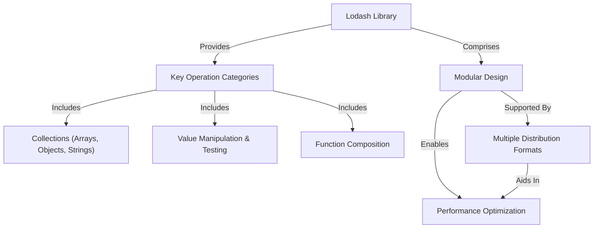

# Core Concepts

Lodash is a modern JavaScript utility library designed to simplify common programming tasks and optimize application performance. It achieves this through a well-defined modular design, offering a wide array of methods for various data types and operations. Understanding these core principles is essential for effectively leveraging Lodash in your projects.

At its heart, Lodash aims to make working with common JavaScript data structures easier. It organizes its extensive functionality into distinct, modular methods. This modularity is a fundamental concept, as it allows you to include only the specific functions you need, which is crucial for minimizing application size and improving load times.

## Lodash Architecture

The following diagram illustrates the key conceptual components and relationships within the Lodash library.

## Key Operation Categories

Lodash provides specialized methods across several core operation categories, making it easier to handle common data transformations and manipulations:

*   **Iterating Collections**: Simplifies looping over arrays, objects, and strings, offering powerful tools to process data efficiently.
*   **Manipulating & Testing Values**: Provides utilities for transforming data, checking types, and validating values, ensuring data integrity and consistency.
*   **Creating Composite Functions**: Enables building more complex and reusable functions by combining simpler ones, promoting a declarative and functional programming style.

## Modular Design and Distribution

Lodash's modular design means that its methods are available as individual modules, allowing for selective imports. This approach significantly contributes to optimizing application size. To support diverse development environments and build processes, Lodash offers a variety of distribution formats.

For a detailed breakdown of these formats and how to create custom builds to further reduce your bundle size, refer to the [Module Formats & Custom Builds](./core-concepts-module-formats.md) section.

## Conclusion

By understanding Lodash's core concepts – its modularity, emphasis on common data operations, and flexible distribution formats – you gain the foundational knowledge to harness its full potential for writing cleaner, more efficient JavaScript code.

Ready to dive deeper into how Lodash packages its modules for different environments? Proceed to the [Module Formats & Custom Builds](./core-concepts-module-formats.md) section.