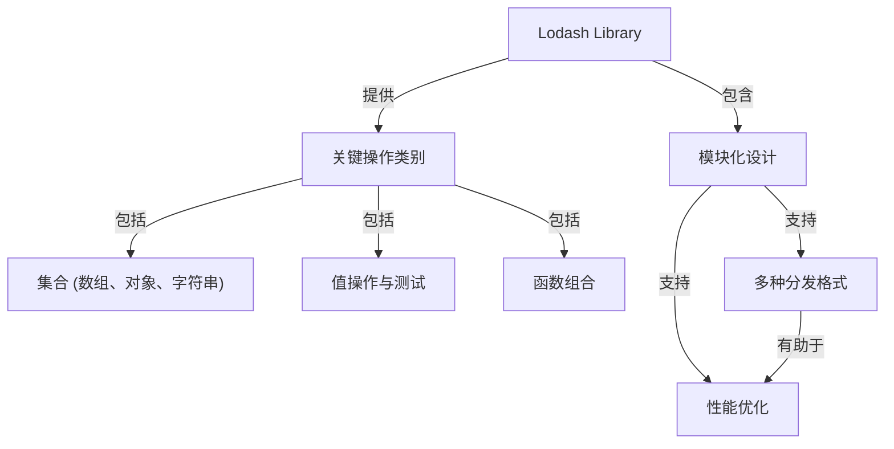

# 核心概念

Lodash 是一个现代 JavaScript 工具库，旨在简化常见的编程任务并优化应用程序性能。它通过良好定义的模块化设计实现这一目标，为各种数据类型和操作提供广泛的方法。理解这些核心原则对于在您的项目中有效利用 Lodash 至关重要。

本质上，Lodash 旨在使处理常见的 JavaScript 数据结构变得更容易。它将其广泛的功能组织成独立、模块化的方法。这种模块化是一个基本概念，因为它允许您只包含所需的特定函数，这对于最大限度地减小应用程序大小和缩短加载时间至关重要。

## Lodash 架构

下图展示了 Lodash 库中的关键概念组件及其关系。

## 关键操作类别

Lodash 在几个核心操作类别中提供了专门的方法，从而更容易处理常见的数据转换和操作：

*   **遍历集合**：简化对数组、对象和字符串的循环操作，提供强大的工具来高效处理数据。
*   **操作与测试值**：提供用于数据转换、类型检查和值验证的实用工具，确保数据完整性和一致性。
*   **创建复合函数**：通过组合更简单的函数来构建更复杂和可重用的函数，推广声明式和函数式编程风格。

## 模块化设计与分发

Lodash 的模块化设计意味着其方法作为独立模块提供，允许选择性导入。这种方法显著有助于优化应用程序大小。为了支持不同的开发环境和构建过程，Lodash 提供了多种分发格式。

有关这些格式的详细分类以及如何创建自定义构建以进一步减小您的包大小，请参阅[模块格式与自定义构建](./core-concepts-module-formats.md)部分。

## 总结

通过理解 Lodash 的核心概念——其模块化、对常见数据操作的强调以及灵活的分发格式——您将获得基础知识，从而充分发挥其潜力，编写更简洁、更高效的 JavaScript 代码。

准备好深入了解 Lodash 如何为不同环境打包其模块了吗？请前往[模块格式与自定义构建](./core-concepts-module-formats.md)部分。