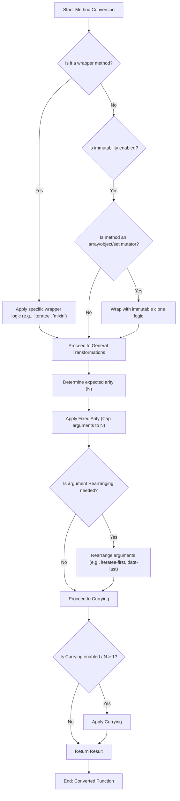

# Functional Programming (FP)

Dive into the functional programming paradigm with Lodash's `lodash/fp` module. This section explains the underlying mechanisms that transform standard Lodash methods into their functional programming counterparts, emphasizing curried, iteratee-first, and data-last methods, along with comprehensive mappings for common aliases. This transformation enables a more declarative and immutable coding style, which is beneficial for writing predictable and maintainable JavaScript.

For a general overview of all available methods, refer to the [API Reference](./api-reference.md).

## Core Principles of `lodash/fp`

The `lodash/fp` module converts traditional Lodash methods to adhere to core functional programming principles. These include:

### Currying

In `lodash/fp`, functions are automatically curried. This means they are transformed to accept their arguments one at a time, returning a new function until all arguments are received. This characteristic enables partial application, where you can pre-fill some arguments and get a new function back, which promotes function composition.

**Example of Currying**
A standard Lodash `_.add(a, b)` becomes `fp.add(a)(b)`.

```javascript
import fp from 'lodash/fp';

const addFive = fp.add(5);
console.log(addFive(10)); // => 15
```

### Iteratee-First, Data-Last

`lodash/fp` reorders method arguments. The iteratee (the callback function) comes first, followed by the data collection or value. This design simplifies function composition, allowing you to chain functions naturally.

**Example of Iteratee-First, Data-Last**
Standard Lodash `_.map(collection, iteratee)` becomes `fp.map(iteratee)(collection)`.

```javascript
import fp from 'lodash/fp';

const square = x => x * x;
const numbers = [1, 2, 3];

const squaredNumbers = fp.map(square)(numbers);
console.log(squaredNumbers); // => [1, 4, 9]

// Composition with pipe
const addOneAndSquare = fp.pipe(fp.add(1), fp.square);
console.log(addOneAndSquare(5));
```

### Immutability

`lodash/fp` promotes immutability. For methods that would mutate arrays or objects in standard Lodash (e.g., `_.pull`, `_.assign`), `lodash/fp` instead returns a new, modified copy of the data. The original data remains unchanged. This behavior helps prevent unintended side effects and makes your code more predictable.

This immutability is achieved by cloning the first argument before applying the operation.

Here are examples of methods that are made immutable in `lodash/fp`:

| Category | Methods |
|---|---|
| Array Mutators | `fill`, `pull`, `pullAll`, `pullAllBy`, `pullAllWith`, `pullAt`, `remove`, `reverse` |
| Object Mutators | `assign`, `assignAll`, `assignAllWith`, `assignIn`, `assignInAll`, `assignInAllWith`, `assignInWith`, `assignWith`, `defaults`, `defaultsAll`, `defaultsDeep`, `defaultsDeepAll`, `merge`, `mergeAll`, `mergeAllWith`, `mergeWith` |
| Set Mutators | `set`, `setWith`, `unset`, `update`, `updateWith` |

## Method Mappings and Aliases

`lodash/fp` provides a set of aliases for methods, often aligning with common functional programming libraries like Ramda, or simply renaming Lodash methods to better fit the FP style. This helps developers transition to or use `lodash/fp` with familiar functional programming terms.

### Common Aliases

Many Lodash methods have aliases in `lodash/fp` to match common functional programming conventions.

| Alias | Real Lodash Name | Description |
|---|---|---|
| `each` | `forEach` | Iterates over elements of a collection. |
| `extend` | `assignIn` | Like `assign`, but also iterates over inherited enumerable string properties. |
| `first` | `head` | Gets the first element of `array`. |
| `all` | `every` | Checks if `predicate` returns truthy for **all** elements of `collection`. |
| `any` | `some` | Checks if `predicate` returns truthy for **any** element of `collection`. |
| `compose` | `flowRight` | Creates a function that returns the result of invoking the given functions from right to left. |
| `contains` | `includes` | Checks if `value` is in `collection`. |
| `equals` | `isEqual` | Performs a deep comparison between two values to determine if they are equivalent. |
| `pipe` | `flow` | Creates a function that returns the result of invoking the given functions from left to right. |
| `pluck` | `map` | Creates an array of values by running each element in `collection` thru `iteratee`. |
| `prop` | `get` | Gets the value at `path` of `object`. |
| `where` | `conformsTo` | Checks if `object` conforms to `source` by invoking the `source`'s predicates against its corresponding property values of `object`. |
| `whereEq` | `isMatch` | Performs a partial deep comparison between `object` and `source` to determine if `object` contains equivalent property values. |
| `zipObj` | `zipObject` | Creates an object composed from arrays of `keys` and `values`. |

### Renamed Methods (`remap`)

Some methods are simply renamed in `lodash/fp` for clarity or consistency, without being an "alias" to an existing Lodash method name. This mapping ensures that the `fp` module aligns with common functional patterns or simplifies method names.

| `lodash/fp` Name | Original Lodash Name | Description |
|---|---|---|
| `assign` | `assignAll` | Assigns enumerable own properties of source objects to the destination object. |
| `curry` | `curryN` | Creates a curried function of `func`. |
| `find` | `findFrom` | This is a variant of `find` that supports a `fromIndex`. `fp` streamlines it to a single `find` with fixed arity. |
| `get` | `getOr` | Gets the value at `path` of `object`. If the resolved value is `undefined`, the `defaultValue` is returned in its place. `fp` simplifies this by expecting default value as an argument. |
| `pad` | `padChars` | Pads `string` on the left and right sides if it's shorter than `length`. |
| `range` | `rangeStep` | Creates a an array of numbers (positive and/or negative) progressing from `start` up to, but not including, `end`. |
| `zip` | `zipAll` | Creates an array of grouped elements, the first of which contains the first elements of the given arrays, the second of which contains the second elements of the given arrays, and so on. |

### Arity-based Methods (`aryMethod`)

The `lodash/fp` module uses a fixed arity for many functions, which is crucial for currying. The `aryMethod` mapping specifies the expected arity for various methods. This means functions are transformed to accept a specific number of arguments, ignoring any additional ones.

For example, methods listed under `aryMethod['2']` are adapted to accept exactly two arguments, and so on. This fixed arity ensures consistency when currying.

## How `lodash/fp` Conversion Works

The conversion process from standard Lodash methods to their `lodash/fp` counterparts involves several steps, orchestrated by a `baseConvert` utility. This utility ensures that methods adhere to the functional programming principles discussed above: currying, fixed arity, immutability, and argument reordering.

Here's a simplified view of the conversion flow for a single method:



This process transforms a regular Lodash method into a curried, iteratee-first, data-last, and immutable function, making it suitable for functional programming paradigms.

---

This section provided an in-depth look into the `lodash/fp` module, detailing its core principles, method transformations, and the mechanics behind its functional programming capabilities. You now have a better understanding of how `lodash/fp` promotes a declarative and immutable coding style.

To explore the full range of available `lodash/fp` methods and their specific signatures, proceed to the [API Reference](./api-reference.md).
