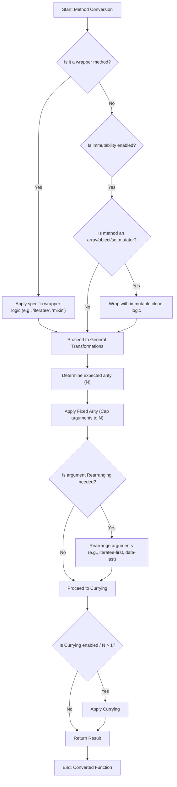

# 函数式编程 (FP)

深入了解 Lodash 的 `lodash/fp` 模块提供的函数式编程范式。本节解释了将标准 Lodash 方法转换为其函数式编程对应物的底层机制，重点介绍了柯里化、迭代器优先和数据后置的方法，以及常见别名的全面映射。这种转换支持更具声明性和不可变性的编码风格，这对于编写可预测和可维护的 JavaScript 非常有益。

有关所有可用方法的概述，请参阅 [API 参考](./api-reference.md)。

## `lodash/fp` 的核心原则

`lodash/fp` 模块将传统的 Lodash 方法转换为符合核心函数式编程原则。其中包括：

### 柯里化

在 `lodash/fp` 中，函数会自动柯里化。这意味着它们被转换为一次接受一个参数，并返回一个新函数，直到接收到所有参数。此特性支持部分应用，您可以在其中预填充一些参数并获得一个新函数，从而促进函数组合。

**柯里化示例**
标准 Lodash `_.add(a, b)` 变为 `fp.add(a)(b)`。

```javascript
import fp from 'lodash/fp';

const addFive = fp.add(5);
console.log(addFive(10)); // => 15
```

### 迭代器优先，数据后置

`lodash/fp` 重新排序方法参数。迭代器（回调函数）在前，后跟数据集合或值。这种设计简化了函数组合，允许您自然地链接函数。

**迭代器优先，数据后置示例**
标准 Lodash `_.map(collection, iteratee)` 变为 `fp.map(iteratee)(collection)`。

```javascript
import fp from 'lodash/fp';

const square = x => x * x;
const numbers = [1, 2, 3];

const squaredNumbers = fp.map(square)(numbers);
console.log(squaredNumbers); // => [1, 4, 9]

// Composition with pipe
const addOneAndSquare = fp.pipe(fp.add(1), fp.square);
console.log(addOneAndSquare(5));
```

### 不可变性

`lodash/fp` 提倡不可变性。对于在标准 Lodash 中会改变数组或对象的方法（例如 `_.pull`、`_.assign`），`lodash/fp` 会返回一个新的、修改后的数据副本。原始数据保持不变。此行为有助于防止意外的副作用并使您的代码更可预测。

这种不可变性是通过在应用操作之前克隆第一个参数来实现的。

以下是 `lodash/fp` 中设置为不可变的方法示例：

| Category | Methods |
|---|---|
| 数组修改器 | `fill`, `pull`, `pullAll`, `pullAllBy`, `pullAllWith`, `pullAt`, `remove`, `reverse` |
| 对象修改器 | `assign`, `assignAll`, `assignAllWith`, `assignIn`, `assignInAll`, `assignInAllWith`, `assignInWith`, `assignWith`, `defaults`, `defaultsAll`, `defaultsDeep`, `defaultsDeepAll`, `merge`, `mergeAll`, `mergeAllWith`, `mergeWith` |
| Set 修改器 | `set`, `setWith`, `unset`, `update`, `updateWith` |

## 方法映射和别名

`lodash/fp` 提供了一组方法的别名，通常与 Ramda 等常见函数式编程库对齐，或者只是重新命名 Lodash 方法以更好地适应 FP 风格。这有助于开发人员使用熟悉的函数式编程术语过渡到或使用 `lodash/fp`。

### 常见别名

许多 Lodash 方法在 `lodash/fp` 中都有别名，以匹配常见的函数式编程约定。

| Alias | Real Lodash Name | Description |
|---|---|---|
| `each` | `forEach` | 遍历集合的元素。 |
| `extend` | `assignIn` | 类似于 `assign`，但也会遍历继承的可枚举字符串属性。 |
| `first` | `head` | 获取 `array` 的第一个元素。 |
| `all` | `every` | 检查 `predicate` 是否对 `collection` 的**所有**元素返回真值。 |
| `any` | `some` | 检查 `predicate` 是否对 `collection` 的**任意**元素返回真值。 |
| `compose` | `flowRight` | 创建一个函数，该函数从右到左调用给定函数并返回结果。 |
| `contains` | `includes` | 检查 `value` 是否在 `collection` 中。 |
| `equals` | `isEqual` | 对两个值进行深度比较以确定它们是否相等。 |
| `pipe` | `flow` | 创建一个函数，该函数从左到右调用给定函数并返回结果。 |
| `pluck` | `map` | 通过对 `collection` 中的每个元素执行 `iteratee` 来创建值数组。 |
| `prop` | `get` | 获取 `object` 中 `path` 处的值。 |
| `where` | `conformsTo` | 通过对照 `object` 的相应属性值调用 `source` 的谓词来检查 `object` 是否符合 `source`。 |
| `whereEq` | `isMatch` | 对 `object` 和 `source` 进行部分深度比较，以确定 `object` 是否包含等效属性值。 |
| `zipObj` | `zipObject` | 从 `keys` 和 `values` 数组中创建一个对象。 |

### 重命名的方法 (`remap`)

`lodash/fp` 中有些方法只是为了清晰或一致性而重命名，而不是作为现有 Lodash 方法名称的“别名”。此映射确保 `fp` 模块与常见函数式模式对齐或简化方法名称。

| `lodash/fp` Name | Original Lodash Name | Description |
|---|---|---|
| `assign` | `assignAll` | 将源对象的可枚举自有属性分配到目标对象。 |
| `curry` | `curryN` | 创建 `func` 的柯里化函数。 |
| `find` | `findFrom` | 这是 `find` 的一个变体，支持 `fromIndex`。`fp` 将其简化为具有固定参数数量的单个 `find`。 |
| `get` | `getOr` | 获取 `object` 中 `path` 处的值。如果解析的值是 `undefined`，则返回 `defaultValue`。`fp` 通过期望默认值作为参数来简化这一点。 |
| `pad` | `padChars` | 如果 `string` 短于 `length`，则在其左右两侧填充。 |
| `range` | `rangeStep` | 创建一个数字数组（正数和/或负数），从 `start` 递增到但不包括 `end`。 |
| `zip` | `zipAll` | 创建一个分组元素的数组，其中第一个包含给定数组的第一个元素，第二个包含给定数组的第二个元素，依此类推。 |

### 基于参数数量的方法 (`aryMethod`)

`lodash/fp` 模块对许多函数使用固定参数数量，这对于柯里化至关重要。`aryMethod` 映射指定了各种方法的预期参数数量。这意味着函数被转换为接受特定数量的参数，忽略任何额外的参数。

例如，`aryMethod['2']` 下列出的方法被调整为精确接受两个参数，依此类推。这种固定参数数量确保了柯里化时的一致性。

## `lodash/fp` 转换工作原理

从标准 Lodash 方法到其 `lodash/fp` 对应物的转换过程涉及多个步骤，由 `baseConvert` 实用程序协调。此实用程序确保方法遵循上述函数式编程原则：柯里化、固定参数数量、不可变性和参数重新排序。

以下是单个方法转换流程的简化视图：



此过程将常规 Lodash 方法转换为柯里化、迭代器优先、数据后置和不可变的函数，使其适用于函数式编程范式。

---

本节深入探讨了 `lodash/fp` 模块，详细介绍了其核心原则、方法转换以及其函数式编程能力背后的机制。您现在对 `lodash/fp` 如何促进声明性和不可变编码风格有了更好的理解。

要探索所有可用的 `lodash/fp` 方法及其特定签名，请转到 [API 参考](./api-reference.md)。