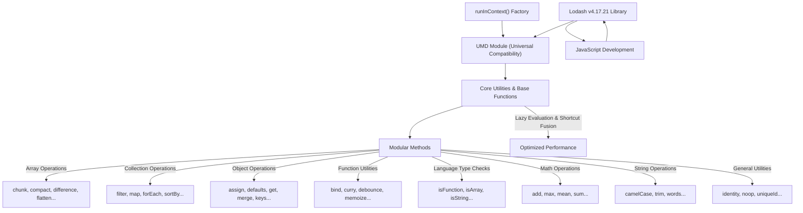

# Overview

Lodash is a widely used modern JavaScript utility library that provides a comprehensive collection of modular methods for common programming tasks. It's designed for high performance and ease of use, streamlining operations across arrays, numbers, objects, and strings. This section introduces the core purpose of Lodash, its key features, and its fundamental architectural principles.

## Why Lodash?

Lodash simplifies JavaScript development by abstracting away the complexities of various data manipulations. Its modular methods are especially useful for:

*   Iterating over arrays, objects, and strings efficiently.
*   Manipulating and testing values with a consistent API.
*   Creating composite functions, aiding in more functional programming styles.

The library's design focuses on delivering a reliable and performant experience for developers.

## Architecture and Design Principles

Lodash is exported as a UMD (Universal Module Definition) module, ensuring compatibility across various JavaScript environments, including browsers and Node.js. Its architecture emphasizes modularity, allowing you to include only the specific functions you need, which helps in optimizing application bundle sizes. While individual methods are available, the core library orchestrates a wide range of utilities, built upon foundational helper functions.

A key aspect of Lodash's design is its lazy evaluation and shortcut fusion capabilities for chained methods. This means that operations in a chain sequence are deferred until a final value is explicitly requested, and multiple iteratee calls can be merged, significantly reducing intermediate array creation and improving performance.

This diagram illustrates the architectural concept of the Lodash library:

## Summary

Lodash provides a robust and efficient set of tools that address common JavaScript programming challenges. Its thoughtful design, including modularity and performance optimizations like lazy evaluation, makes it an invaluable asset for building reliable and performant applications.

To begin integrating Lodash into your projects, proceed to the [Getting Started](./getting-started.md) section.