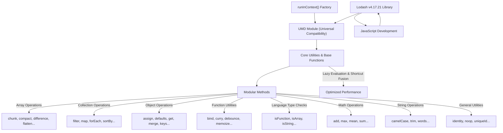

# 概述

Lodash 是一个被广泛使用的现代 JavaScript 工具库，它为常见的编程任务提供了一系列全面的模块化方法。它设计旨在实现高性能和易用性，简化了对数组、数字、对象和字符串的操作。本节将介绍 Lodash 的核心目的、主要特性及其基本架构原则。

## 为什么选择 Lodash？

Lodash 通过抽象化各种数据操作的复杂性，简化了 JavaScript 开发。其模块化方法在以下方面特别有用：

*   高效地迭代数组、对象和字符串。
*   使用一致的 API 操作和测试值。
*   创建复合函数，有助于采用更函数式的编程风格。

该库的设计重点在于为开发者提供可靠且高性能的体验。

## 架构与设计原则

Lodash 作为 UMD (通用模块定义) 模块导出，确保了在各种 JavaScript 环境（包括浏览器和 Node.js）中的兼容性。其架构强调模块化，允许您只包含所需的特定函数，这有助于优化应用程序的打包大小。虽然单个方法可用，但核心库协调了广泛的实用工具，这些工具都建立在基础辅助函数之上。

Lodash 设计的一个关键方面是其针对链式方法的惰性求值和快捷融合能力。这意味着链式序列中的操作会延迟执行，直到显式请求最终值时才执行，并且多个迭代器调用可以合并，从而显著减少中间数组的创建并提高性能。

下图展示了 Lodash 库的架构概念：

## 总结

Lodash 提供了一套强大而高效的工具，能够解决常见的 JavaScript 编程挑战。其周到的设计，包括模块化和惰性求值等性能优化，使其成为构建可靠且高性能应用程序的宝贵资产。

要开始将 Lodash 集成到您的项目中，请前往[开始使用](./getting-started.md)部分。