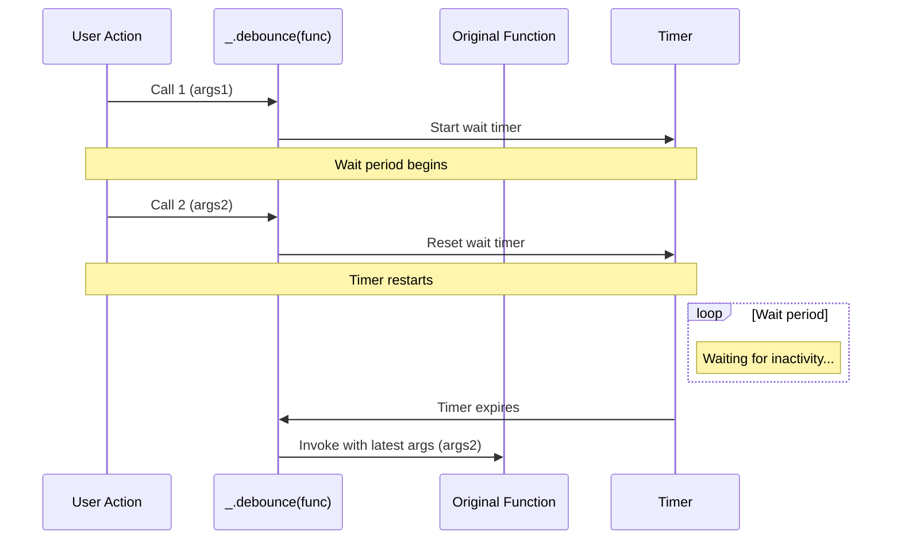
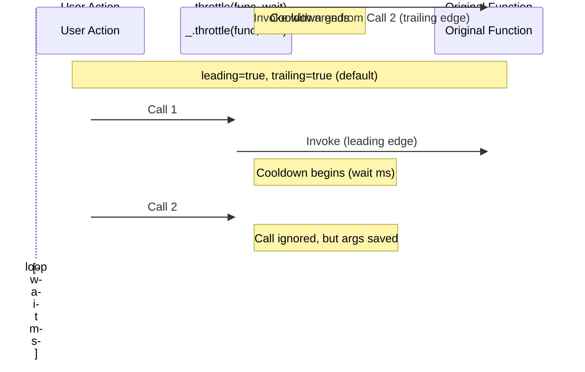

# Function

This section details utilities in Lodash for manipulating or returning functions. These functions support functional programming techniques like currying, debouncing, throttling, and partial application, enabling the creation of more robust and flexible code.

These tools are particularly useful in scenarios such as event handling, asynchronous operations, and function composition. To learn how to use these functions with method chaining, see the documentation for the [Seq (Sequence)](./api-seq.md) section.

## after

Creates a function that invokes `func` once it's called `n` or more times. The inverse of `_.before`.

| Arguments | Type | Description |
| --- | --- | --- |
| `n` | `number` | The number of calls before `func` is invoked. |
| `func` | `Function` | The function to restrict. |

**Returns**

- `(Function)`: Returns the new restricted function.

**Example**

```javascript
var saves = ['profile', 'settings'];

var done = _.after(saves.length, function() {
  console.log('done saving!');
});

_.forEach(saves, function(type) {
  asyncSave({ 'type': type, 'complete': done });
});
// => Logs 'done saving!' after the two async saves have completed.
```

## ary

Creates a function that accepts up to `n` arguments, ignoring any additional arguments.

| Arguments | Type | Description |
| --- | --- | --- |
| `func` | `Function` | The function to cap arguments for. |
| `[n=func.length]` | `number` | The arity cap. |

**Returns**

- `(Function)`: Returns the new capped function.

**Example**

```javascript
_.map(['6', '8', '10'], _.ary(parseInt, 1));
// => [6, 8, 10]
```

## before

Creates a function that invokes `func` while it's called less than `n` times. Subsequent calls to the function return the result of the last `func` invocation.

| Arguments | Type | Description |
| --- | --- | --- |
| `n` | `number` | The number of calls at which `func` is no longer invoked. |
| `func` | `Function` | The function to restrict. |

**Returns**

- `(Function)`: Returns the new restricted function.

**Example**

```javascript
jQuery(element).on('click', _.before(5, addContactToList));
// => Allows adding up to 4 contacts to the list.
```

## bind

Creates a function that invokes `func` with the `this` binding of `thisArg` and `partials` prepended to the arguments it receives. The `_.bind.placeholder` value, which defaults to `_` in monolithic builds, may be used as a placeholder for partially applied arguments.

| Arguments | Type | Description |
| --- | --- | --- |
| `func` | `Function` | The function to bind. |
| `thisArg` | `*` | The `this` binding of `func`. |
| `[...partials]` | `*` | The arguments to prepend. |

**Returns**

- `(Function)`: Returns the new bound function.

**Example**

```javascript
function greet(greeting, punctuation) {
  return greeting + ' ' + this.user + punctuation;
}

var object = { 'user': 'fred' };

var bound = _.bind(greet, object, 'hi');
bound('!');
// => 'hi fred!'

// Bound with placeholders.
var bound = _.bind(greet, object, _, '!');
bound('hi');
// => 'hi fred!'
```

## bindKey

Creates a function that invokes the method at `object[key]` with `partials` prepended to the arguments it receives. This method differs from `_.bind` by allowing the bound function to reference a method that may be redefined or not yet exist.

| Arguments | Type | Description |
| --- | --- | --- |
| `object` | `Object` | The object to invoke the method on. |
| `key` | `string` | The key of the method. |
| `[...partials]` | `*` | The arguments to prepend. |

**Returns**

- `(Function)`: Returns the new bound function.

**Example**

```javascript
var object = {
  'user': 'fred',
  'greet': function(greeting, punctuation) {
    return greeting + ' ' + this.user + punctuation;
  }
};

var bound = _.bindKey(object, 'greet', 'hi');
bound('!');
// => 'hi fred!'

object.greet = function(greeting, punctuation) {
  return greeting + 'ya ' + this.user + punctuation;
};

bound('!');
// => 'hiya fred!'
```

## curry

Creates a function that accepts arguments for `func`. If enough arguments are provided, it invokes `func` and returns the result; otherwise, it returns a function that accepts the remaining arguments. The `_.curry.placeholder` value can be used as a placeholder for arguments.

| Arguments | Type | Description |
| --- | --- | --- |
| `func` | `Function` | The function to curry. |
| `[arity=func.length]` | `number` | The arity of `func`. |

**Returns**

- `(Function)`: Returns the new curried function.

**Example**

```javascript
var abc = function(a, b, c) {
  return [a, b, c];
};

var curried = _.curry(abc);

curried(1)(2)(3);
// => [1, 2, 3]

curried(1, 2)(3);
// => [1, 2, 3]

// Curried with placeholders.
curried(1)(_, 3)(2);
// => [1, 2, 3]
```

## curryRight

This method is like `_.curry` except that arguments are applied to `func` in the manner of `_.partialRight`.

| Arguments | Type | Description |
| --- | --- | --- |
| `func` | `Function` | The function to curry. |
| `[arity=func.length]` | `number` | The arity of `func`. |

**Returns**

- `(Function)`: Returns the new curried function.

**Example**

```javascript
var abc = function(a, b, c) {
  return [a, b, c];
};

var curried = _.curryRight(abc);

curried(3)(2)(1);
// => [1, 2, 3]

curried(2, 3)(1);
// => [1, 2, 3]
```

## debounce

Creates a debounced function that delays invoking `func` until after `wait` milliseconds have elapsed since the last time the debounced function was invoked. The debounced function comes with a `cancel` method to cancel delayed `func` invocations and a `flush` method to immediately invoke them. Provide `options` to indicate whether `func` should be invoked on the leading and/or trailing edge of the `wait` timeout.



| Arguments | Type | Description |
| --- | --- | --- |
| `func` | `Function` | The function to debounce. |
| `[wait=0]` | `number` | The number of milliseconds to delay. |
| `[options={}]` | `Object` | The options object. |
| `[options.leading=false]` | `boolean` | Specify invoking on the leading edge of the timeout. |
| `[options.maxWait]` | `number` | The maximum time `func` is allowed to be delayed before it's invoked. |
| `[options.trailing=true]` | `boolean` | Specify invoking on the trailing edge of the timeout. |

**Returns**

- `(Function)`: Returns the new debounced function.

**Example**

```javascript
// Avoid costly calculations while the window size is in flux.
jQuery(window).on('resize', _.debounce(calculateLayout, 150));

// Invoke `sendMail` at the leading edge of the debounce, and disregard
// trailing calls.
jQuery(element).on('click', _.debounce(sendMail, 300, {
  'leading': true,
  'trailing': false
}));

// Cancel the trailing debounced invocation.
jQuery(window).on('popstate', debounced.cancel);
```

## defer

Defers invoking `func` until the current call stack has cleared. Any additional arguments are provided to `func` when it's invoked.

| Arguments | Type | Description |
| --- | --- | --- |
| `func` | `Function` | The function to defer. |
| `[...args]` | `*` | The arguments to invoke `func` with. |

**Returns**

- `(number)`: Returns the timer id.

**Example**

```javascript
_.defer(function(text) {
  console.log(text);
}, 'deferred');
// => Logs 'deferred' after one millisecond.
```

## delay

Invokes `func` after `wait` milliseconds. Any additional arguments are provided to `func` when it's invoked.

| Arguments | Type | Description |
| --- | --- | --- |
| `func` | `Function` | The function to delay. |
| `wait` | `number` | The number of milliseconds to delay invocation. |
| `[...args]` | `*` | The arguments to invoke `func` with. |

**Returns**

- `(number)`: Returns the timer id.

**Example**

```javascript
_.delay(function(text) {
  console.log(text);
}, 1000, 'later');
// => Logs 'later' after one second.
```

## flip

Creates a function that invokes `func` with its arguments reversed.

| Arguments | Type | Description |
| --- | --- | --- |
| `func` | `Function` | The function to flip arguments for. |

**Returns**

- `(Function)`: Returns the new flipped function.

**Example**

```javascript
var flipped = _.flip(function() {
  return _.toArray(arguments);
});

flipped('a', 'b', 'c', 'd');
// => ['d', 'c', 'b', 'a']
```

## memoize

Creates a function that memoizes the result of `func`. If `resolver` is provided, it determines the cache key for storing the result based on the arguments provided to the memoized function. By default, the first argument provided to the memoized function is used as the cache key.

| Arguments | Type | Description |
| --- | --- | --- |
| `func` | `Function` | The function to have its output memoized. |
| `[resolver]` | `Function` | The function to resolve the cache key. |

**Returns**

- `(Function)`: Returns the new memoized function.

**Example**

```javascript
var object = { 'a': 1, 'b': 2 };
var other = { 'c': 3, 'd': 4 };

var values = _.memoize(_.values);
values(object);
// => [1, 2]

values(other);
// => [3, 4]

object.a = 2;
values(object);
// => [1, 2] (returns cached result)

// Modify the result cache.
values.cache.set(object, ['a', 'b']);
values(object);
// => ['a', 'b']
```

## negate

Creates a function that negates the result of the predicate `func`.

| Arguments | Type | Description |
| --- | --- | --- |
| `predicate` | `Function` | The predicate to negate. |

**Returns**

- `(Function)`: Returns the new negated function.

**Example**

```javascript
function isEven(n) {
  return n % 2 == 0;
}

_.filter([1, 2, 3, 4, 5, 6], _.negate(isEven));
// => [1, 3, 5]
```

## once

Creates a function that is restricted to invoking `func` once. Repeat calls to the function return the value of the first invocation.

| Arguments | Type | Description |
| --- | --- | --- |
| `func` | `Function` | The function to restrict. |

**Returns**

- `(Function)`: Returns the new restricted function.

**Example**

```javascript
var initialize = _.once(createApplication);
initialize();
initialize();
// => `createApplication` is invoked once
```

## overArgs

Creates a function that invokes `func` with its arguments transformed.

| Arguments | Type | Description |
| --- | --- | --- |
| `func` | `Function` | The function to wrap. |
| `[...transforms]` | `(Function|Function[])` | The argument transforms. |

**Returns**

- `(Function)`: Returns the new function.

**Example**

```javascript
function doubled(n) {
  return n * 2;
}

function square(n) {
  return n * n;
}

var func = _.overArgs(function(x, y) {
  return [x, y];
}, [square, doubled]);

func(9, 3);
// => [81, 6]
```

## partial

Creates a function that invokes `func` with `partials` prepended to the arguments it receives. This method is like `_.bind` except it does not alter the `this` binding.

| Arguments | Type | Description |
| --- | --- | --- |
| `func` | `Function` | The function to partially apply arguments to. |
| `[...partials]` | `*` | The arguments to be partially applied. |

**Returns**

- `(Function)`: Returns the new partially applied function.

**Example**

```javascript
function greet(greeting, name) {
  return greeting + ' ' + name;
}

var sayHelloTo = _.partial(greet, 'hello');
sayHelloTo('fred');
// => 'hello fred'
```

## partialRight

This method is like `_.partial` except that partially applied arguments are appended to the arguments it receives.

| Arguments | Type | Description |
| --- | --- | --- |
| `func` | `Function` | The function to partially apply arguments to. |
| `[...partials]` | `*` | The arguments to be partially applied. |

**Returns**

- `(Function)`: Returns the new partially applied function.

**Example**

```javascript
function greet(greeting, name) {
  return greeting + ' ' + name;
}

var greetFred = _.partialRight(greet, 'fred');
greetFred('hi');
// => 'hi fred'
```

## rearg

Creates a function that invokes `func` with arguments rearranged according to the specified `indexes`.

| Arguments | Type | Description |
| --- | --- | --- |
| `func` | `Function` | The function to rearrange arguments for. |
| `[...indexes]` | `(number|number[])` | The rearranged argument indexes. |

**Returns**

- `(Function)`: Returns the new function.

**Example**

```javascript
var rearged = _.rearg(function(a, b, c) {
  return [a, b, c];
}, [2, 0, 1]);

rearged('b', 'c', 'a')
// => ['a', 'b', 'c']
```

## rest

Creates a function that invokes `func` with the `this` binding and an array of arguments from the `start` position.

| Arguments | Type | Description |
| --- | --- | --- |
| `func` | `Function` | The function to apply rest parameters to. |
| `[start=func.length-1]` | `number` | The start position of rest parameters. |

**Returns**

- `(Function)`: Returns the new function.

**Example**

```javascript
var say = _.rest(function(what, names) {
  return what + ' ' + _.initial(names).join(', ') +
    (_.size(names) > 1 ? ', & ' : '') + _.last(names);
});

say('hello', 'fred', 'barney', 'pebbles');
// => 'hello fred, barney, & pebbles'
```

## spread

Creates a function that invokes `func` with a `this` binding and an array of arguments, similar to `Function#apply`.

| Arguments | Type | Description |
| --- | --- | --- |
| `func` | `Function` | The function to spread arguments over. |
| `[start=0]` | `number` | The start position of the spread. |

**Returns**

- `(Function)`: Returns the new function.

**Example**

```javascript
var say = _.spread(function(who, what) {
  return who + ' says ' + what;
});

say(['fred', 'hello']);
// => 'fred says hello'
```

## throttle

Creates a throttled function that only invokes `func` at most once per every `wait` milliseconds. The throttled function comes with a `cancel` method to cancel delayed `func` invocations and a `flush` method to immediately invoke them.



| Arguments | Type | Description |
| --- | --- | --- |
| `func` | `Function` | The function to throttle. |
| `[wait=0]` | `number` | The number of milliseconds to throttle invocations to. |
| `[options={}]` | `Object` | The options object. |
| `[options.leading=true]` | `boolean` | Specify invoking on the leading edge of the timeout. |
| `[options.trailing=true]` | `boolean` | Specify invoking on the trailing edge of the timeout. |

**Returns**

- `(Function)`: Returns the new throttled function.

**Example**

```javascript
// Avoid excessively updating position while scrolling.
jQuery(window).on('scroll', _.throttle(updatePosition, 100));

// Cancel the trailing throttled invocation.
jQuery(window).on('popstate', throttled.cancel);
```

## unary

Creates a function that accepts up to one argument, ignoring any additional arguments.

| Arguments | Type | Description |
| --- | --- | --- |
| `func` | `Function` | The function to cap arguments for. |

**Returns**

- `(Function)`: Returns the new capped function.

**Example**

```javascript
_.map(['6', '8', '10'], _.unary(parseInt));
// => [6, 8, 10]
```

## wrap

Creates a function that provides `value` to `wrapper` as its first argument. Any additional arguments provided to the function are appended to those provided to `wrapper`.

| Arguments | Type | Description |
| --- | --- | --- |
| `value` | `*` | The value to wrap. |
| `[wrapper=identity]` | `Function` | The wrapping function. |

**Returns**

- `(Function)`: Returns the new function.

**Example**

```javascript
var p = _.wrap(_.escape, function(func, text) {
  return '<p>' + func(text) + '</p>';
});

p('fred, barney, & pebbles');
// => '<p>fred, barney, &amp; pebbles</p>'
```

---

This section covers the core functional utilities in Lodash. Mastering these functions will help you write more concise, declarative code. Next, you can explore the [Lang](./api-lang.md) section for utilities like type checking and object cloning.