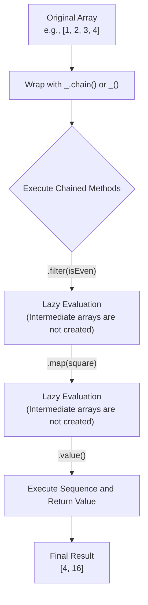

# Seq

Functions in the Seq (Sequence) category are used to create and process method chains. By wrapping a value in a Lodash instance, you can chain multiple methods together to process data in an expressive and efficient way. This chaining supports lazy evaluation, which means that the operations in the chain are deferred until the `value()` method is called explicitly or implicitly.

## Chaining Flow

The core idea of a method chain is to create a wrapper object, apply a series of transformations to it, and finally extract the final result. This process can be clearly illustrated by the following diagram:



## API Reference

The following are the main functions related to sequence chaining:

### _.chain

Creates a `lodash` wrapper instance that enables explicit method chaining. Explicit chaining means that the `_#value` method must be used to unwrap and get the resulting value.

**Arguments**

| Name | Type | Description |
|---|---|---|
| `value` | `*` | The value to wrap. |

**Returns**

(`Object`): Returns the new `lodash` wrapper instance.

**Example**

```javascript
var users = [
  { 'user': 'barney',  'age': 36 },
  { 'user': 'fred',    'age': 40 },
  { 'user': 'pebbles', 'age': 1 }
];

var youngest = _
  .chain(users)
  .sortBy('age')
  .map(function(o) {
    return o.user + ' is ' + o.age;
  })
  .head()
  .value();
// => 'pebbles is 1'
```

### _.tap

This method invokes `interceptor` and returns `value`. The `interceptor` is invoked with one argument: (`value`). The purpose of this method is to "tap into" a method chain sequence in order to modify intermediate results or perform other operations (side effects) in the chain.

**Arguments**

| Name | Type | Description |
|---|---|---|
| `value` | `*` | The value to provide to `interceptor`. |
| `interceptor` | `Function` | The function to invoke. |

**Returns**

(`*`): Returns `value`.

**Example**

```javascript
_([1, 2, 3])
 .tap(function(array) {
   // Mutate the array.
   array.pop();
 })
 .reverse()
 .value();
// => [2, 1]
```

### _.thru

This method is like `_.tap` except that it returns the result of `interceptor`. The purpose of this method is to "pass thru" a value to replace the intermediate result in a method chain sequence.

**Arguments**

| Name | Type | Description |
|---|---|---|
| `value` | `*` | The value to provide to `interceptor`. |
| `interceptor` | `Function` | The function to invoke. |

**Returns**

(`*`): Returns the result of `interceptor`.

**Example**

```javascript
_('  abc  ')
 .chain()
 .trim()
 .thru(function(value) {
   return [value];
 })
 .value();
// => ['abc']
```

### commit

Executes the chained sequence and returns the wrapped result.

**Returns**

(`Object`): Returns the new `lodash` wrapper instance.

**Example**

```javascript
var array = [1, 2];
var wrapped = _(array).push(3);

console.log(array);
// => [1, 2]

wrapped = wrapped.commit();
console.log(array);
// => [1, 2, 3]

wrapped.last();
// => 3

console.log(array);
// => [1, 2, 3]
```

### plant

Creates a clone of the chained sequence, planting `value` as the wrapped value. This allows you to reuse a sequence of chained operations but apply it to different initial data.

**Arguments**

| Name | Type | Description |
|---|---|---|
| `value` | `*` | The value to plant. |

**Returns**

(`Object`): Returns the new `lodash` wrapper instance.

**Example**

```javascript
function square(n) {
  return n * n;
}

var wrapped = _([1, 2]).map(square);
var other = wrapped.plant([3, 4]);

other.value();
// => [9, 16]

wrapped.value();
// => [1, 4]
```

### value

Executes the chained sequence to resolve the unwrapped value. This is the standard way to get the final result of a chain.

**Aliases**

`toJSON`, `valueOf`

**Returns**

(`*`): Returns the resolved unwrapped value.

**Example**

```javascript
_([1, 2, 3]).value();
// => [1, 2, 3]
```