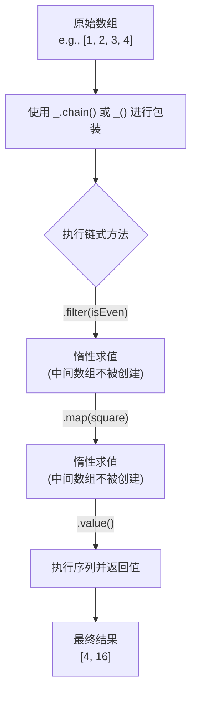

# Seq

Seq（序列）类别下的函数用于创建和处理方法链。通过将值包装在 Lodash 实例中，您可以将多个方法串联起来，以一种富有表现力且高效的方式处理数据。这种链式调用支持惰性求值，这意味着在显式或隐式调用 `value()` 方法之前，链中的操作会被延迟执行。

## 链式调用流程

方法链的核心思想是创建一个包装器对象，对该对象应用一系列转换，最后提取最终结果。这个过程可以通过下图清晰地展示：



## API 参考

以下是与序列化链式调用相关的主要函数：

### _.chain

创建一个启用了显式方法链的 `lodash` 包装器实例。显式链式调用意味着必须使用 `_#value` 方法来解开包装并获取结果值。

**参数**

| 名称 | 类型 | 描述 |
|---|---|---|
| `value` | `*` | 要包装的值。 |

**返回**

(`Object`): 返回新的 `lodash` 包装器实例。

**示例**

```javascript
var users = [
  { 'user': 'barney',  'age': 36 },
  { 'user': 'fred',    'age': 40 },
  { 'user': 'pebbles', 'age': 1 }
];

var youngest = _
  .chain(users)
  .sortBy('age')
  .map(function(o) {
    return o.user + ' is ' + o.age;
  })
  .head()
  .value();
// => 'pebbles is 1'
```

### _.tap

此方法调用 `interceptor` 并返回 `value`。`interceptor` 被调用时会传入一个参数：(`value`)。此方法的目的是“接入”一个方法链序列，以便在链中修改中间结果或执行其他操作（副作用）。

**参数**

| 名称 | 类型 | 描述 |
|---|---|---|
| `value` | `*` | 提供给 `interceptor` 的值。 |
| `interceptor` | `Function` | 要调用的函数。 |

**返回**

(`*`): 返回 `value`。

**示例**

```javascript
_([1, 2, 3])
 .tap(function(array) {
   // 改变输入的数组
   array.pop();
 })
 .reverse()
 .value();
// => [2, 1]
```

### _.thru

此方法类似于 `_.tap`，但它返回 `interceptor` 的结果。此方法的目的是“传递”值，在方法链序列中替换中间结果。

**参数**

| 名称 | 类型 | 描述 |
|---|---|---|
| `value` | `*` | 提供给 `interceptor` 的值。 |
| `interceptor` | `Function` | 要调用的函数。 |

**返回**

(`*`): 返回 `interceptor` 的结果。

**示例**

```javascript
_('  abc  ')
 .chain()
 .trim()
 .thru(function(value) {
   return [value];
 })
 .value();
// => ['abc']
```

### commit

执行链式调用序列并返回包装后的结果。

**返回**

(`Object`): 返回新的 `lodash` 包装器实例。

**示例**

```javascript
var array = [1, 2];
var wrapped = _(array).push(3);

console.log(array);
// => [1, 2]

wrapped = wrapped.commit();
console.log(array);
// => [1, 2, 3]

wrapped.last();
// => 3

console.log(array);
// => [1, 2, 3]
```

### plant

创建一个链式调用序列的克隆，并将 `value` 作为包装值植入。这允许您复用一个链式操作序列，但作用于不同的初始数据。

**参数**

| 名称 | 类型 | 描述 |
|---|---|---|
| `value` | `*` | 要植入的值。 |

**返回**

(`Object`): 返回新的 `lodash` 包装器实例。

**示例**

```javascript
function square(n) {
  return n * n;
}

var wrapped = _([1, 2]).map(square);
var other = wrapped.plant([3, 4]);

other.value();
// => [9, 16]

wrapped.value();
// => [1, 4]
```

### value

执行链式调用序列以解析出未包装的值。这是获取链式调用最终结果的标准方法。

**别名**

`toJSON`, `valueOf`

**返回**

(`*`): 返回解析后的未包装值。

**示例**

```javascript
_([1, 2, 3]).value();
// => [1, 2, 3]
```