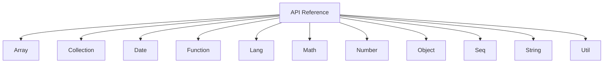

# API Reference

Welcome to the Lodash API Reference. This section provides a comprehensive, searchable reference for all Lodash methods, organized by data type for quick lookup. Each category includes detailed function signatures, parameter descriptions, return values, and ready-to-use code examples.

## API Category Overview

To help you quickly locate the functions you need, we have divided the Lodash API into the following core categories:

The table below lists all API categories and their descriptions. Click on a category name to jump to the corresponding detailed documentation page.

| Category | Description |
|---|---|
| [Array](./api-array.md) | A detailed reference for all Lodash functions that operate on or return arrays. |
| [Collection](./api-collection.md) | A detailed reference for all Lodash functions that iterate over collections like arrays and objects. |
| [Date](./api-date.md) | A detailed reference for all Lodash functions for working with Date objects. |
| [Function](./api-function.md) | A detailed reference for all Lodash functions that operate on or return functions, such as debouncing and currying. |
| [Lang](./api-lang.md) | A detailed reference for all Lodash language utility functions, including type checking and cloning. |
| [Math](./api-math.md) | A detailed reference for all Lodash math utility functions. |
| [Number](./api-number.md) | A detailed reference for all Lodash functions that operate on or return numbers. |
| [Object](./api-object.md) | A detailed reference for all Lodash functions for manipulating and processing objects. |
| [Seq](./api-seq.md) | A detailed reference for all Lodash functions related to chained method calls. |
| [String](./api-string.md) | A detailed reference for all Lodash functions for string manipulation and checking. |
| [Util](./api-util.md) | A detailed reference for other Lodash utility functions. |

With these categories, you can systematically explore and learn the rich features Lodash offers. If you would like to learn about Lodash's functional programming paradigm, please see our [Functional Programming Guide](./fp-guide.md).