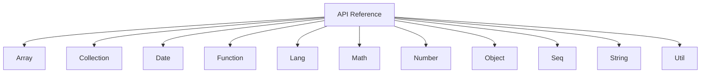

# API 参考

欢迎来到 Lodash API 参考。本节提供了所有 Lodash 方法的全面、可搜索的参考资料，按数据类型组织以便快速查找。每个类别都包含详细的函数签名、参数说明、返回值和可直接使用的代码示例。

## API 类别概览

为了帮助您快速定位所需的功能，我们将 Lodash 的 API 划分为以下几个核心类别：

下表列出了所有 API 类别及其说明。点击类别名称可跳转至相应的详细文档页面。

| 类别 | 描述 |
|---|---|
| [Array](./api-array.md) | 针对操作或返回数组的所有 Lodash 函数的详细参考。 |
| [Collection](./api-collection.md) | 针对迭代数组和对象等集合的所有 Lodash 函数的详细参考。 |
| [Date](./api-date.md) | 针对处理 Date 对象的所有 Lodash 函数的详细参考。 |
| [Function](./api-function.md) | 针对操作或返回函数（如防抖和柯里化）的所有 Lodash 函数的详细参考。 |
| [Lang](./api-lang.md) | 针对所有 Lodash 语言工具函数（包括类型检查和克隆）的详细参考。 |
| [Math](./api-math.md) | 针对所有 Lodash 数学工具函数的详细参考。 |
| [Number](./api-number.md) | 针对操作或返回数字的所有 Lodash 函数的详细参考。 |
| [Object](./api-object.md) | 针对操作和处理对象的所有 Lodash 函数的详细参考。 |
| [Seq](./api-seq.md) | 针对与链式方法调用相关的所有 Lodash 函数的详细参考。 |
| [String](./api-string.md) | 针对字符串操作和检查的所有 Lodash 函数的详细参考。 |
| [Util](./api-util.md) | 针对其他 Lodash 工具函数的详细参考。 |

通过以上分类，您可以系统地浏览和学习 Lodash 提供的丰富功能。如果您想了解 Lodash 的函数式编程范式，请查阅我们的 [函数式编程指南](./fp-guide.md)。