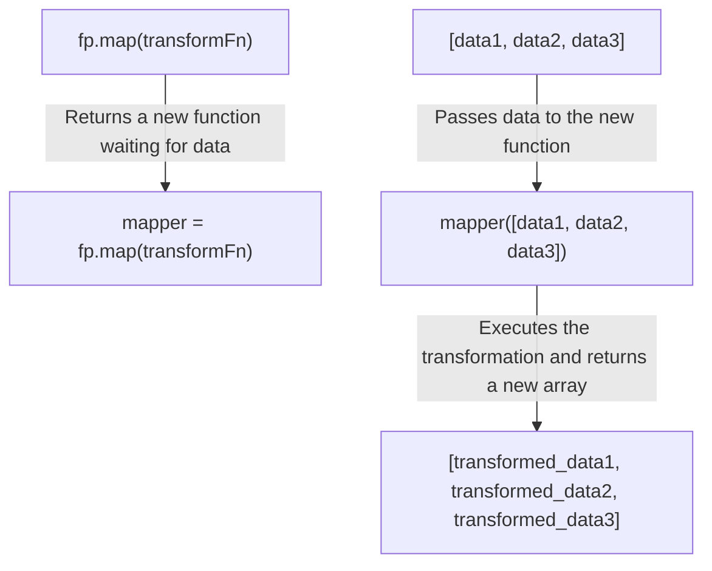

# Functional Programming Guide

The `lodash/fp` module provides a functional programming (FP) version of Lodash, designed for developers who prefer an immutable, auto-curried, iteratee-first, and data-last style. This guide will detail its core concepts and usage.

The main features of the functional version include:

- **Immutability**: Methods do not mutate input data, but instead return new data copies.
- **Auto-currying**: All methods are curried, making it easy to create partial functions.
- **Iteratee-first, data-last**: Function signatures are rearranged to take the data collection as the last argument, facilitating function composition.
- **Fixed arity**: Functions have a fixed number of parameters to support currying.

## Core Concepts

### Immutability

In standard Lodash, some methods mutate the input array or object directly (e.g., `_.pull`). In `lodash/fp`, all methods with side effects are wrapped as pure functions to ensure they do not modify the original data. They return a new, modified instance.

Here is a list of methods that have been made immutable:

| Type | Methods |
|---|---|
| **Array** | `fill`, `pull`, `pullAll`, `pullAllBy`, `pullAllWith`, `pullAt`, `remove`, `reverse` |
| **Object** | `assign`, `assignAll`, `assignAllWith`, `assignIn`, `assignInAll`, `assignInAllWith`, `assignInWith`, `assignWith`, `defaults`, `defaultsAll`, `defaultsDeep`, `defaultsDeepAll`, `merge`, `mergeAll`, `mergeAllWith`, `mergeWith` |
| **Set** | `set`, `setWith`, `unset`, `update`, `updateWith` |

### Auto-currying and Data-last

All functions in `lodash/fp` are auto-curried. This means when you call a function with fewer arguments than it expects, it returns a new function that waits to receive the remaining arguments. This mechanism, combined with the "data-last" parameter order, greatly enhances the composability of functions.

For example, you can easily create a reusable function to extract a specific property from an object:

```javascript
const fp = require('lodash/fp');

// `fp.get` requires a path argument. Since only one argument is provided,
// it returns a new function that waits to receive an object.
const getName = fp.get('name');

const user1 = { name: 'Alice', age: 30 };
const user2 = { name: 'Bob', age: 40 };

// Apply the new function to different data
console.log(getName(user1)); // Outputs: 'Alice'
console.log(getName(user2)); // Outputs: 'Bob'
```

This process can be illustrated by the following diagram:



#### Placeholder

`lodash/fp` supports using a placeholder `_` for currying, allowing you to specify later arguments first. The placeholder is the `fp` object itself.

```javascript
const fp = require('lodash/fp');

// Create a function that subtracts 10 from any number
const subtract10 = fp.subtract(_, 10);

console.log(subtract10(25)); // Outputs: 15
```

### Argument Order Rearrangement

To implement the "data-last" principle, `lodash/fp` has adjusted the argument order of many native Lodash methods. Typically, the iteratee, path, or configuration object is the first argument, while the collection or object to be operated on is the last.

The following table shows a comparison of the argument order for some common methods:

| Method | Standard Lodash Signature | `lodash/fp` Signature |
|---|---|---|
| `map` | `_.map(collection, iteratee)` | `fp.map(iteratee)(collection)` |
| `filter` | `_.filter(collection, predicate)` | `fp.filter(predicate)(collection)` |
| `get` | `_.get(object, path, [defaultValue])` | `fp.get(path)(object)` or `fp.getOr(defaultValue, path)(object)` |
| `reduce` | `_.reduce(collection, iteratee, [accumulator])` | `fp.reduce(iteratee, accumulator)(collection)` |
| `set` | `_.set(object, path, value)` | `fp.set(path, value)(object)` |

## Method Aliases

To improve compatibility with other functional programming libraries (like Ramda) and provide more semantic naming, `lodash/fp` introduces numerous method aliases.

### Internal Lodash Aliases

| Real Name | Alias |
|---|---|
| `forEach` | `each` |
| `forEachRight` | `eachRight` |
| `toPairs` | `entries` |
| `toPairsIn` | `entriesIn`|
| `assignIn` | `extend` |
| `head` | `first` |

### Ramda Compatibility Aliases

| Real Name | Ramda Alias |
|---|---|
| `placeholder` | `__` |
| `stubFalse` | `F` |
| `stubTrue` | `T` |
| `every` | `all` |
| `overEvery` | `allPass` |
| `constant` | `always` |
| `some` | `any` |
| `overSome` | `anyPass` |
| `spread` | `apply` |
| `set` | `assoc`, `assocPath` |
| `negate` | `complement` |
| `flowRight` | `compose` |
| `includes` | `contains` |
| `unset` | `dissoc`, `dissocPath` |
| `dropRight` | `dropLast` |
| `isEqual` | `equals` |
| `eq` | `identical` |
| `keyBy` | `indexBy` |
| `initial` | `init` |
| `invert` | `invertObj` |
| `over` | `juxt` |
| `flow` | `pipe` |
| `get` | `path`, `prop` |
| `at` | `paths`, `props` |
| `matchesProperty` | `pathEq`, `propEq` |
| `xor` | `symmetricDifference` |
| `flatten` | `unnest` |
| `overArgs` | `useWith` |
| `conformsTo` | `where` |
| `isMatch` | `whereEq` |
| `zipObject` | `zipObj` |

## Custom Conversions

`lodash/fp` provides a `convert` method that allows you to create a custom `lodash` instance based on specific requirements. You can finely control behaviors like currying, immutability, and more.

The `convert` method accepts a configuration object with the following options:

- `cap` (boolean): Whether to cap the number of arguments for iteratees. Default is `true`.
- `curry` (boolean): Whether to enable currying. Default is `true`.
- `fixed` (boolean): Whether to use a fixed arity. Default is `true`.
- `immutable` (boolean): Whether to enforce immutability. Default is `true`.
- `rearg` (boolean): Whether to reorder argument positions. Default is `true`.

**Example: Creating an FP version with argument rearrangement disabled**

```javascript
const fp = require('lodash/fp');
const _ = require('lodash');

// Create a custom instance whose function signatures are consistent with standard lodash, but still supports auto-currying
const customFp = fp.convert({ 'rearg': false });

const collection = [{ 'a': 1 }, { 'a': 2 }];

// Standard lodash style call
const result1 = customFp.map(collection, 'a');
console.log(result1); // Outputs: [1, 2]

// Currying still works
const getA = customFp.map(_, 'a');
const result2 = getA(collection);
console.log(result2); // Outputs: [1, 2]
```

This feature allows developers to precisely customize the library's behavior according to their project's specific functional programming style.