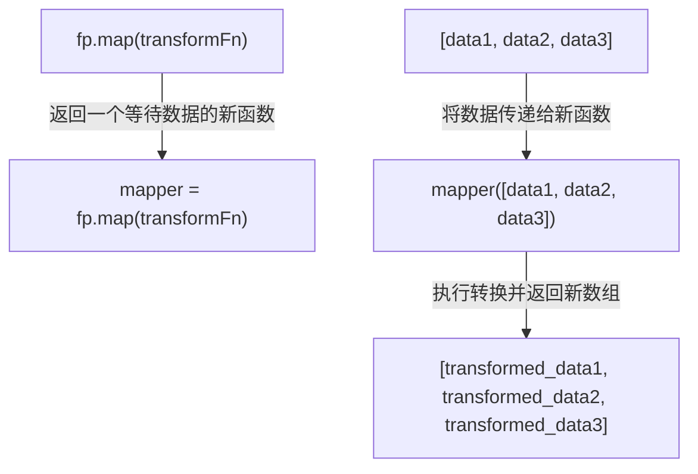

# Functional Programming Guide

`lodash/fp` 模块提供了 Lodash 的函数式编程（FP）版本，专为偏爱不可变、自动柯里化、迭代优先和数据置后风格的开发者设计。本指南将详细介绍其核心概念和使用方法。

函数式版本的主要特性包括：

- **不可变性 (Immutability)**: 方法不会修改输入数据，而是返回新的数据副本。
- **自动柯里化 (Auto-currying)**: 所有方法都经过柯里化处理，可以轻松地创建偏函数。
- **迭代优先、数据置后 (Iteratee-first, data-last)**: 函数签名经过重新排列，将数据集合作为最后一个参数，便于函数组合。
- **固定元数 (Fixed arity)**: 函数具有固定的参数数量，以支持柯里化。

## 核心概念

### 不可变性 (Immutability)

在标准 Lodash 中，一些方法会直接修改传入的数组或对象（例如 `_.pull`）。而在 `lodash/fp` 中，所有具有副作用的方法都被封装为纯函数，确保不会修改原始数据。它们会返回一个经过修改的新实例。

以下是经过不可变处理的方法列表：

| 类型 | 方法 |
|---|---|
| **Array** | `fill`, `pull`, `pullAll`, `pullAllBy`, `pullAllWith`, `pullAt`, `remove`, `reverse` |
| **Object** | `assign`, `assignAll`, `assignAllWith`, `assignIn`, `assignInAll`, `assignInAllWith`, `assignInWith`, `assignWith`, `defaults`, `defaultsAll`, `defaultsDeep`, `defaultsDeepAll`, `merge`, `mergeAll`, `mergeAllWith`, `mergeWith` |
| **Set** | `set`, `setWith`, `unset`, `update`, `updateWith` |

### 自动柯里化与数据置后

`lodash/fp` 中的所有函数都是自动柯里化的。这意味着当你使用比函数预期更少的参数调用它时，它会返回一个新函数，等待接收剩余的参数。这种机制与“数据置后”的参数顺序相结合，极大地增强了函数的可组合性。

例如，你可以轻松创建一个可重用的函数来提取对象中的特定属性：

```javascript
const fp = require('lodash/fp');

// `fp.get` 需要一个路径参数。由于只提供了一个参数，
// 它返回一个新函数，该函数等待接收一个对象。
const getName = fp.get('name');

const user1 = { name: 'Alice', age: 30 };
const user2 = { name: 'Bob', age: 40 };

// 将新函数应用于不同的数据
console.log(getName(user1)); // 输出: 'Alice'
console.log(getName(user2)); // 输出: 'Bob'
```

这个过程可以用下图来表示：



#### 占位符 (Placeholder)

`lodash/fp` 支持使用占位符 `_` 来进行柯里化，允许你先指定后面的参数。占位符是 `fp` 对象本身。

```javascript
const fp = require('lodash/fp');

// 创建一个函数，它会从任意数字中减去 10
const subtract10 = fp.subtract(_, 10);

console.log(subtract10(25)); // 输出: 15
```

### 参数顺序重排

为了实现“数据置后”的原则，`lodash/fp` 对许多原生 Lodash 方法的参数顺序进行了调整。通常，迭代函数（iteratee）、属性路径（path）或配置对象会作为第一个参数，而要操作的集合或对象则作为最后一个参数。

下表展示了一些常见方法的参数顺序对比：

| 方法 | 标准 Lodash 签名 | `lodash/fp` 签名 |
|---|---|---|
| `map` | `_.map(collection, iteratee)` | `fp.map(iteratee)(collection)` |
| `filter` | `_.filter(collection, predicate)` | `fp.filter(predicate)(collection)` |
| `get` | `_.get(object, path, [defaultValue])` | `fp.get(path)(object)` 或 `fp.getOr(defaultValue, path)(object)` |
| `reduce` | `_.reduce(collection, iteratee, [accumulator])` | `fp.reduce(iteratee, accumulator)(collection)` |
| `set` | `_.set(object, path, value)` | `fp.set(path, value)(object)` |

## 方法别名

为了提升与其他函数式编程库（如 Ramda）的兼容性并提供更符合语义的命名，`lodash/fp` 引入了大量的方法别名。

### Lodash 内部别名

| 真实名称 | 别名 |
|---|---|
| `forEach` | `each` |
| `forEachRight` | `eachRight` |
| `toPairs` | `entries` |
| `toPairsIn` | `entriesIn`|
| `assignIn` | `extend` |
| `head` | `first` |

### Ramda 兼容性别名

| 真实名称 | Ramda 别名 |
|---|---|
| `placeholder` | `__` |
| `stubFalse` | `F` |
| `stubTrue` | `T` |
| `every` | `all` |
| `overEvery` | `allPass` |
| `constant` | `always` |
| `some` | `any` |
| `overSome` | `anyPass` |
| `spread` | `apply` |
| `set` | `assoc`, `assocPath` |
| `negate` | `complement` |
| `flowRight` | `compose` |
| `includes` | `contains` |
| `unset` | `dissoc`, `dissocPath` |
| `dropRight` | `dropLast` |
| `isEqual` | `equals` |
| `eq` | `identical` |
| `keyBy` | `indexBy` |
| `initial` | `init` |
| `invert` | `invertObj` |
| `over` | `juxt` |
| `flow` | `pipe` |
| `get` | `path`, `prop` |
| `at` | `paths`, `props` |
| `matchesProperty` | `pathEq`, `propEq` |
| `xor` | `symmetricDifference` |
| `flatten` | `unnest` |
| `overArgs` | `useWith` |
| `conformsTo` | `where` |
| `isMatch` | `whereEq` |
| `zipObject` | `zipObj` |

## 自定义转换

`lodash/fp` 提供了 `convert` 方法，允许你根据特定需求创建一个自定义的 `lodash` 实例。你可以精细地控制柯里化、不可变性等行为。

`convert` 方法接受一个配置对象，包含以下选项：

- `cap` (boolean): 是否限制迭代函数的参数数量，默认为 `true`。
- `curry` (boolean): 是否进行柯里化，默认为 `true`。
- `fixed` (boolean): 是否使用固定元数，默认为 `true`。
- `immutable` (boolean): 是否强制不可变性，默认为 `true`。
- `rearg` (boolean): 是否重排参数顺序，默认为 `true`。

**示例：创建一个禁用参数重排的 FP 版本**

```javascript
const fp = require('lodash/fp');
const _ = require('lodash');

// 创建一个自定义实例，其函数签名与标准 lodash 保持一致，但仍支持自动柯里化
const customFp = fp.convert({ 'rearg': false });

const collection = [{ 'a': 1 }, { 'a': 2 }];

// 标准 lodash 风格调用
const result1 = customFp.map(collection, 'a');
console.log(result1); // 输出: [1, 2]

// 柯里化仍然有效
const getA = customFp.map(_, 'a');
const result2 = getA(collection);
console.log(result2); // 输出: [1, 2]
```

这个功能允许开发者根据项目的具体函数式编程风格来精确定制库的行为。