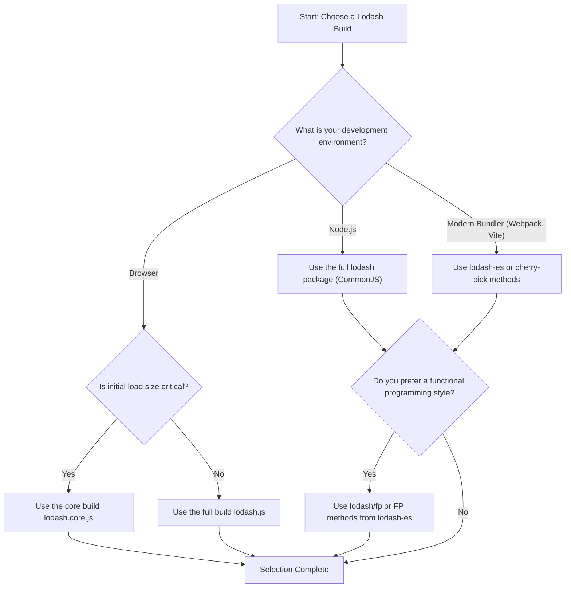

# Build Differences

Lodash offers various build versions and module formats to suit different development environments and performance requirements. Choosing the right build version can significantly optimize your application's bundle size and loading speed. This guide will explain in detail the differences between the various available build versions and guide you on how to choose the one that best suits your project.

## Main Builds

Lodash primarily provides two pre-compiled builds: the full build and the core build.

| Feature | Full Build | Core Build |
|---|---|---|
| Description | The complete version that includes all Lodash functionalities. | A lightweight version that includes only the most common and core functions, without extra features like `chain`. |
| gzipped Size | ~24 kB | ~4 kB |
| How to Import | `require('lodash')` | `require('lodash/core')` |
| Use Cases | Node.js backends, rapid prototyping, or applications where bundle size is not a concern. | Front-end projects, mobile applications, and scenarios with high initial load performance requirements. |

You can download these builds directly from the official website or a CDN:

- **Core Build**: [lodash.core.js](https://raw.githubusercontent.com/lodash/lodash/4.17.21/dist/lodash.core.js)
- **Full Build**: [lodash.js](https://raw.githubusercontent.com/lodash/lodash/4.17.21/dist/lodash.js)
- **More CDN Options**: [JSDelivr](https://www.jsdelivr.com/projects/lodash)

## Module Formats and On-Demand Loading

To better integrate with the modern JavaScript ecosystem, Lodash supports multiple module formats and encourages on-demand loading to minimize the final bundle size.

### 1. UMD (Universal Module Definition)

The standard `lodash` npm package uses the UMD format, allowing it to work seamlessly in various environments, including browser globals, AMD (like RequireJS), and CommonJS (like Node.js).

**Browser Environment:**
```html
<script src="lodash.js"></script>
```

**Node.js Environment:**
```javascript
// Load the full build
var _ = require('lodash');

// Load the core build
var _ = require('lodash/core');
```

### 2. Cherry-picking Individual Methods

This is the most recommended optimization method for front-end projects. You can import only the methods you need, and bundlers (like webpack or Rollup) will automatically perform tree shaking, significantly reducing the bundle size.

```javascript
// Import only the at method, not the entire library
var at = require('lodash/at');

// Also applicable to the FP build
var curryN = require('lodash/fp/curryN');
```

### 3. ES Modules (`lodash-es`)

If you are working in an environment that supports ES modules, you can install the `lodash-es` package. It provides native ES module import and export syntax, which works better with modern front-end toolchains (like Vite, webpack) for more efficient tree shaking.

You can also use [babel-plugin-lodash](https://www.npmjs.com/package/babel-plugin-lodash) and [lodash-webpack-plugin](https://www.npmjs.com/package/lodash-webpack-plugin) to automate the process of cherry-picking.

### 4. Functional Programming (FP) Build

Lodash offers a dedicated functional programming version, which features auto-curried methods, an "iteratee-first, data-last" argument order, and is immutable.

```javascript
// Load the FP build
var fp = require('lodash/fp');
```

For more information on the FP build, please refer to the [FP Guide](./fp-guide.md).

## How to Choose the Right Build

You can use the following flowchart to make a decision:



## Creating Custom Builds

For advanced users with special requirements, the `lodash-cli` tool can be used to create custom builds that include only the methods you need.

First, ensure that the project dependencies are installed, then you can run the build scripts.

```shell
# Run the built-in build script to generate files in the dist directory
$ npm run build

# Use lodash-cli to create a full build
$ lodash -o ./dist/lodash.js

# Use lodash-cli to create a core build
$ lodash core -o ./dist/lodash.core.js
```

By understanding the differences between these builds, you can make the best choice for your project, finding the perfect balance between functionality and performance. Next, you may want to delve into [Performance Optimization Tips](./guides-performance.md) to further improve your code's efficiency.