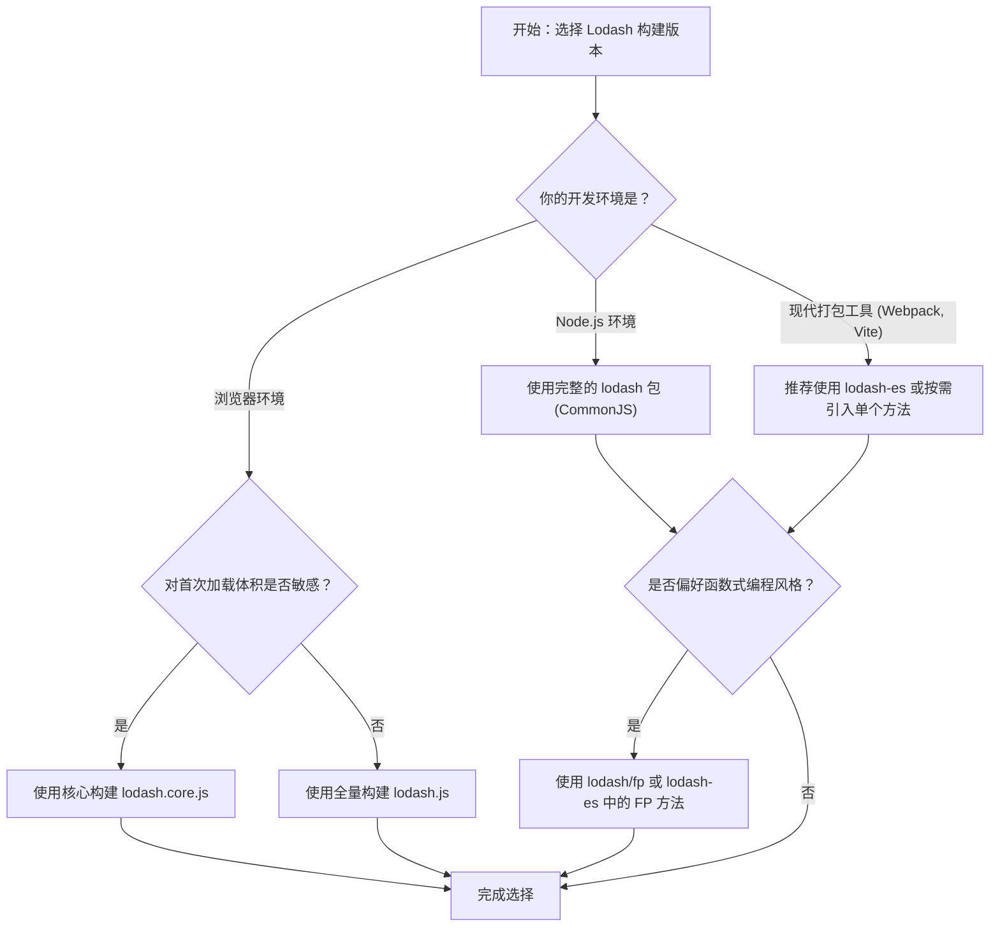

# Build Differences

Lodash 提供了多种构建版本和模块格式，以适应不同的开发环境和性能要求。选择合适的构建版本可以显著优化应用程序的包大小和加载速度。本指南将详细解释各种可用构建版本之间的差异，并指导你如何选择最适合你项目的那一个。

## 主要构建版本

Lodash 主要提供两个预编译的构建版本：全量构建和核心构建。

| 特性 | 全量构建 (Full Build) | 核心构建 (Core Build) |
|---|---|---|
| 描述 | 包含所有 Lodash 功能的完整版本。 | 一个轻量级版本，仅包含最常用和核心的函数，不含 `chain` 等额外功能。 |
| gzipped 大小 | ~24 kB | ~4 kB |
| 引入方式 | `require('lodash')` | `require('lodash/core')` |
| 适用场景 | Node.js 后端、快速原型开发，或对包大小不敏感的应用。 | 前端项目、移动端，以及对初始加载性能要求高的场景。 |

你可以通过官方网站或 CDN 直接下载这些构建版本：

- **核心构建**: [lodash.core.js](https://raw.githubusercontent.com/lodash/lodash/4.17.21/dist/lodash.core.js)
- **全量构建**: [lodash.js](https://raw.githubusercontent.com/lodash/lodash/4.17.21/dist/lodash.js)
- **更多CDN选项**: [JSDelivr](https://www.jsdelivr.com/projects/lodash)

## 模块格式与按需加载

为了与现代 JavaScript 生态系统更好地集成，Lodash 支持多种模块格式，并鼓励按需加载以最小化最终打包体积。

### 1. UMD (通用模块定义)

标准的 `lodash` npm 包采用 UMD 格式，使其可以在多种环境中无缝工作，包括浏览器全局变量、AMD (如 RequireJS) 和 CommonJS (如 Node.js)。

**浏览器环境:**
```html
<script src="lodash.js"></script>
```

**Node.js 环境:**
```javascript
// 加载全量构建
var _ = require('lodash');

// 加载核心构建
var _ = require('lodash/core');
```

### 2. 按需加载单个方法 (Cherry-picking)

这是前端项目中最推荐的优化方式。你可以只引入需要的方法，打包工具（如 webpack 或 Rollup）会自动进行摇树优化 (Tree Shaking)，从而显著减小包体积。

```javascript
// 仅引入 at 方法，而不是整个库
var at = require('lodash/at');

// 同样适用于 FP 构建
var curryN = require('lodash/fp/curryN');
```

### 3. ES 模块 (`lodash-es`)

如果你在使用支持 ES 模块的环境，可以安装 `lodash-es` 包。它提供了原生的 ES 模块导入和导出语法，能更好地与现代前端工具链（如 Vite, webpack）配合，实现更高效的摇树优化。

同时，可以配合使用 [babel-plugin-lodash](https://www.npmjs.com/package/babel-plugin-lodash) 和 [lodash-webpack-plugin](https://www.npmjs.com/package/lodash-webpack-plugin) 来自动化按需加载的转换过程。

### 4. 函数式编程 (FP) 构建

Lodash 提供了一个专门的函数式编程版本，其特点是方法自动柯里化、参数顺序为 “iteratee-first, data-last”，并且是不可变的。

```javascript
// 加载 FP 构建
var fp = require('lodash/fp');
```

关于 FP 构建的更多信息，请参阅 [函数式编程指南](./fp-guide.md)。

## 如何选择合适的构建版本

你可以根据以下流程图来决策：



## 创建自定义构建

对于有特殊需求的高级用户，可以使用 `lodash-cli` 工具来创建自定义的构建版本，精确包含你所需要的方法。

首先，确保项目依赖已安装，然后可以运行构建脚本。

```shell
# 运行内置的构建脚本来生成 dist 目录下的文件
$ npm run build

# 使用 lodash-cli 创建一个全量构建
$ lodash -o ./dist/lodash.js

# 使用 lodash-cli 创建一个核心构建
$ lodash core -o ./dist/lodash.core.js
```

通过理解这些构建版本之间的差异，你可以为你的项目做出最佳选择，在功能和性能之间找到完美的平衡。接下来，你可能希望深入了解 [性能优化技巧](./guides-performance.md) 来进一步提升代码效率。