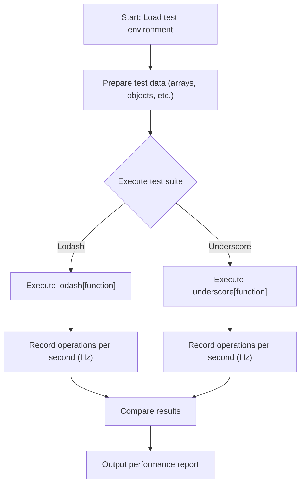

# Performance

One of Lodash's core design principles is to provide excellent performance. To deliver on this promise, we have established a comprehensive performance testing suite that continuously benchmarks Lodash against other popular libraries like Underscore.js. This guide will share insights derived from these tests and instruct you on how to leverage Lodash's internal optimizations to write high-performance code.

## Performance Testing Framework

Lodash uses the [Benchmark.js](https://benchmarkjs.com/) library to ensure the statistical significance and reliability of test results. The testing process is designed to simulate real-world usage scenarios, covering a wide range of operations from simple array iteration to complex deep object comparisons. This ensures that our optimizations are targeted at practical applications rather than trivial microbenchmarks.

Here is the basic flow of the performance tests:



Each test suite compares the performance of Lodash against another library (usually Underscore.js) on the same task, reporting which is faster and by how much. Finally, the results of all tests are aggregated, and an overall performance advantage or disadvantage is calculated using a geometric mean.

## Running Your Own Benchmarks

We encourage you to run the performance tests in your own environment to verify Lodash's performance in your specific use cases. You can easily run our performance test suite in your browser:

1.  Clone the Lodash repository: `git clone https://github.com/lodash/lodash.git`
2.  Open the `lodash/perf/index.html` file directly in your browser.
3.  The top-right corner of the page provides a dropdown menu that allows you to select different Lodash and Underscore.js builds for comparison.
4.  The tests will start running automatically, and the results will be output in real-time to your browser's developer tools console.

## Key Benchmark Scenarios

Performance tests cover the vast majority of Lodash's functionality. The following table lists some representative test scenarios that highlight Lodash's performance advantages and internal optimization mechanisms.

| Category | Test Function/Method | Test Scenario Description |
|---|---|---|
| Chaining | `_(...).map(...).filter(...).take(...).value()` | Tests the performance of lazy evaluation in chaining by fusing multiple operations to avoid creating intermediate arrays, thereby improving efficiency. |
| Object Operations | `_.assign` | Tests the performance of merging single and multiple source objects, a common operation for object extension and merging. |
| Functions | `_.bind` | Covers various binding scenarios, including multiple bindings and partial application, to ensure minimal overhead in function calls. |
| Arrays | `_.difference`, `_.intersection`, `_.union` | Benchmarks set operations on arrays of different sizes, which are very common in data processing. |
| Collection Iteration | `_.each`, `_.filter`, `_.map` | Measures the performance of iterating over arrays and objects, and tests internal optimization paths like using property name shorthands. |
| Deep Comparison | `_.isEqual` | Compares different types of primitive values, objects, nested arrays, and arrays of objects to ensure high efficiency and accuracy with complex data structures. |
| Utilities | `_.clone`, `_.flattenDeep` | Tests the performance of common utility functions, such as shallow cloning of objects and deep flattening of arrays. |

## Performance Optimization Tips

Based on our benchmarks and the library's design, here are some tips to help you write more performant code:

### 1. Utilize Lazy Evaluation

When you chain multiple methods together, Lodash uses lazy evaluation to defer execution until `value()` is explicitly or implicitly called. This mechanism minimizes the number of iterations by fusing multiple operations into a single pass, which significantly improves performance, especially when dealing with large datasets.

```javascript
// This chained call iterates only once, not three times
const result = _(largeArray)
  .map(square)
  .filter(even)
  .take(100)
  .value();
```

For more information on chaining, see the [Seq (Chaining)](./api-seq.md) section.

### 2. Use Property Shorthands

In many collection functions (like `_.filter`, `_.map`, `_.find`, `_.sortBy`), you can use a property name string, a property path array, or an object as the iteratee. These shorthands not only make your code more concise but also often invoke internal, optimized paths that are faster than providing a custom callback function.

```javascript
// More performant way
lodash.filter(objects, { 'active': true, 'role': 'admin' });

lodash.map(objects, 'user.name');

// Compared to
lodash.filter(objects, o => o.active && o.role === 'admin');

lodash.map(objects, o => o.user.name);
```

### 3. Choose the Right Build

Lodash offers multiple builds. For performance-sensitive applications that are also concerned with load times, consider creating a custom build that includes only the methods you need. A smaller library means faster parsing and initialization times. For details, see our [Build Differences Guide](./guides-build-differences.md).

---

Performance is an ongoing focus for Lodash. By understanding its internal optimizations and applying the tips above, you can ensure your application fully leverages the speed and efficiency Lodash offers. If you have questions about performance in a specific use case, running the benchmarks is the best way to find the answer.