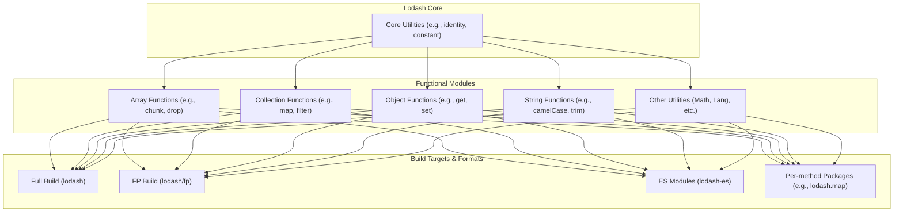

# Overview

Lodash is a modern JavaScript utility library that provides modularity, high performance, and customizable builds. It makes JavaScript programming easier by simplifying common operations on data structures such as arrays, numbers, objects, and strings. Lodash is released under the MIT license, and its current version is v4.17.21.

### Core Philosophy & Features

Lodash's design philosophy centers on modularity and consistency. It offers a vast collection of performance-optimized helper functions designed to address common pain points in JavaScript development. Its key features include:

- **Collection Iteration**: Easily iterate over arrays, objects, and strings.
- **Value Manipulation & Testing**: Provides a rich set of tools for handling and validating various data types.
- **Composite Function Creation**: Powerful functional programming support for creating composite functions.

### Modular Architecture

Lodash uses a modular architecture, allowing developers to selectively load features based on their needs, thus optimizing the final application's bundle size. This structure has also given rise to various build versions and usage methods.

### Available Module Formats

Lodash offers various build versions and module formats to accommodate different project requirements and bundlers. For more details, please see the [Build Differences Guide](./guides-build-differences.md).

| Format/Build Version | NPM Package | Description |
|---|---|---|
| Standard Build | `lodash` | Provides the full feature set in UMD format, suitable for Node.js and browser environments. |
| Per-method Packages | `lodash.map`, `lodash.get`, ... | Each method is published as an individual package, allowing for fine-grained, on-demand loading. This is ideal for small projects or scenarios with strict bundle size requirements. |
| ES Modules | `lodash-es` | Provides an ES module version, facilitating Tree Shaking with modern bundlers like Webpack and Rollup. |
| Functional Programming (FP) | `lodash/fp` | Provides an immutable, auto-curried, function-first, data-last functional programming version. |
| AMD Build | `lodash-amd` | A build version specifically for projects using the AMD specification (like RequireJS). |
| Plugins | `babel-plugin-lodash`, `lodash-webpack-plugin` | Automatically transforms `import` statements into per-method imports via Babel or Webpack plugins, simplifying the optimization process. |

### How to Use This Documentation

To help you quickly find the information you need, this documentation is organized by topic:

- **[Getting Started](./getting-started.md)**: Provides instructions for quickly installing and using Lodash in different environments.
- **[API Reference](./api.md)**: A complete list of methods organized by data type, including detailed parameter descriptions and examples.
- **[Functional Programming Guide](./fp-guide.md)**: An in-depth look at Lodash's functional programming features.
- **[Advanced Guides](./guides.md)**: Covers advanced topics such as performance optimization and custom builds.
- **[Security Policy](./security.md)**: Learn about the project's security update policy and vulnerability reporting process.
- **[Community & Contributing](./contributing.md)**: Join community discussions or contribute code to the project.

### Next Steps

Now that you have a basic understanding of Lodash, we recommend starting with the [Getting Started guide](./getting-started.md) to quickly integrate it into your project.