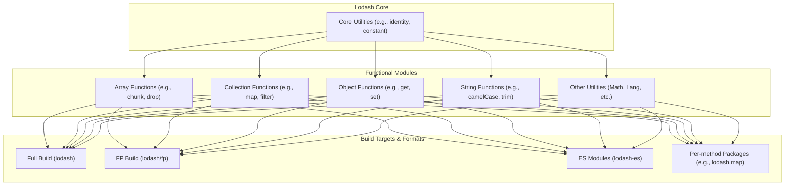

# 概述

Lodash 是一个现代 JavaScript 工具库，致力于提供模块化、高性能以及可定制的构建。它通过简化对数组、数字、对象、字符串等常见数据结构的操作，让 JavaScript 编程变得更加轻松。Lodash 遵循 MIT 许可证，当前版本为 v4.17.21。

### 核心理念与特性

Lodash 的设计哲学围绕模块化和一致性。它提供了大量经过性能优化的辅助函数，旨在解决 JavaScript 开发中的常见痛点，其主要特性包括：

- **集合迭代**: 轻松遍历数组、对象和字符串。
- **值操作与测试**: 提供丰富的工具用于处理和验证各种数据类型。
- **复合函数创建**: 强大的函数式编程支持，便于创建组合函数。

### 模块化架构

Lodash 采用模块化的架构，允许开发者根据需求选择性地加载功能，从而优化最终应用程序的体积。这种结构也催生了多种不同的构建版本和使用方式。

### 可用模块格式

Lodash 提供了多种构建版本和模块格式，以适应不同的项目需求和打包工具。更多详细信息请参考 [构建差异指南](./guides-build-differences.md)。

| 格式/构建版本 | NPM 包 | 描述 |
|---|---|---|
| 标准构建 | `lodash` | 提供 UMD 格式的完整功能集，适用于 Node.js 和浏览器环境。 |
| Per-method 包 | `lodash.map`, `lodash.get`, ... | 将每个方法发布为独立的包，实现极致的按需加载，非常适合小型项目或对打包体积有严格要求的场景。 |
| ES Modules | `lodash-es` | 提供 ES 模块版本，便于与 Webpack、Rollup 等现代打包工具配合进行 Tree Shaking。 |
| 函数式编程 (FP) | `lodash/fp` | 提供不可变、自动柯里化、函数优先、数据置后的函数式编程版本。 |
| AMD 构建 | `lodash-amd` | 专门为使用 AMD 规范（如 RequireJS）的项目提供的构建版本。 |
| 插件 | `babel-plugin-lodash`, `lodash-webpack-plugin` | 通过 Babel 或 Webpack 插件自动将 `import` 转换为 per-method 的引入方式，简化优化过程。 |

### 如何使用本文档

为了帮助你快速找到所需信息，本文档按主题进行了组织：

- **[入门指南](./getting-started.md)**: 提供在不同环境中快速安装和使用 Lodash 的说明。
- **[API 参考](./api.md)**: 按数据类型组织的完整方法列表，包含详细的参数说明和示例。
- **[函数式编程指南](./fp-guide.md)**: 深入了解 Lodash 的函数式编程特性。
- **[高级指南](./guides.md)**: 包含性能优化、自定义构建等高级主题。
- **[安全策略](./security.md)**: 了解项目的安全更新策略和漏洞报告流程。
- **[社区与贡献](./contributing.md)**: 加入社区讨论或为项目贡献代码。

### 下一步

现在你已经对 Lodash 有了初步的了解。我们建议你从 [入门指南](./getting-started.md) 开始，快速在你的项目中集成 Lodash。